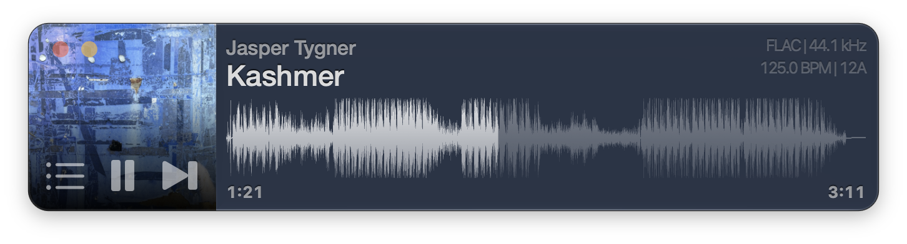
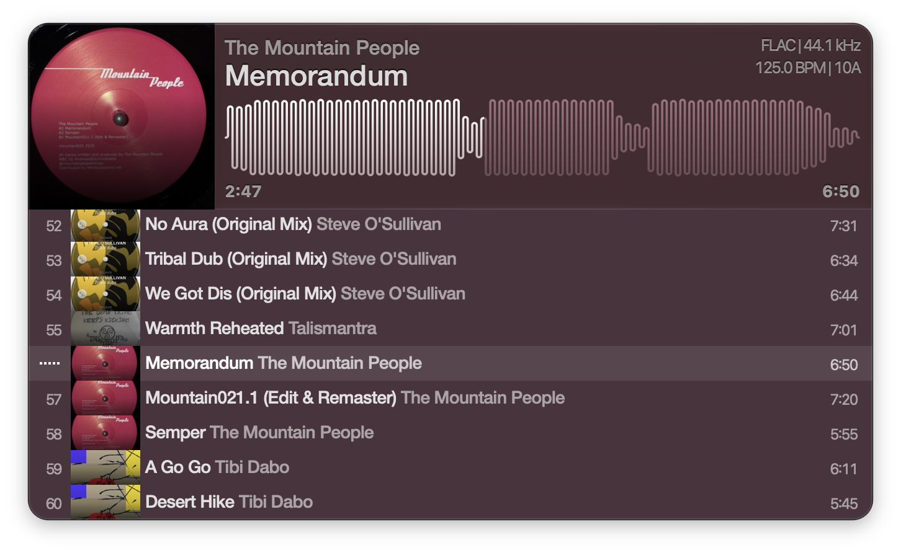
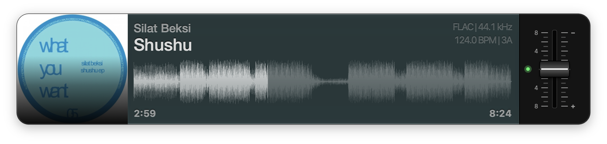
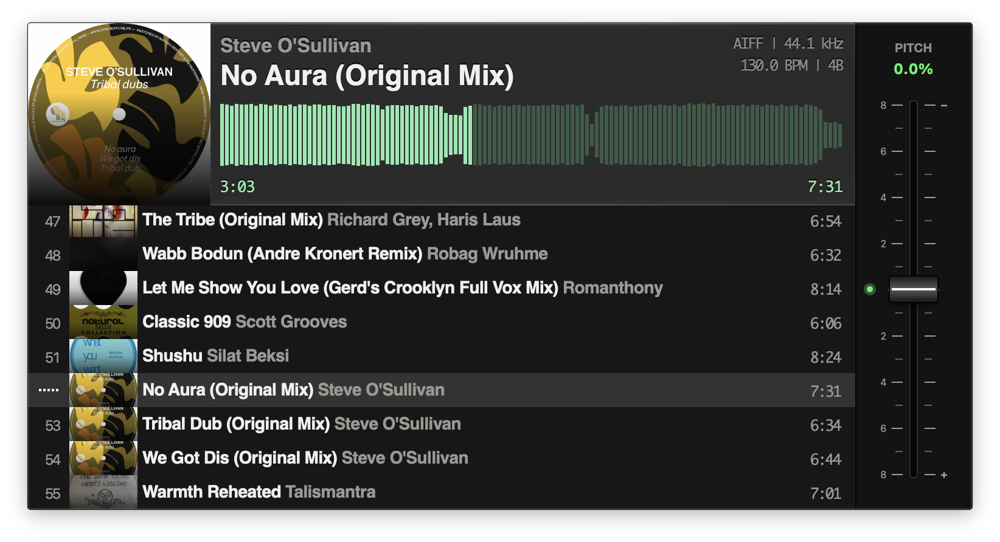

# Vibe

A fast and minimal winamp-inspired native music player for macOS. Built with DJs in mind with large local libraries, lossless files, and the need to quickly sort and scrub through tracks.



## Features

[](https://apps.apple.com/us/app/vibe-music-player/id1582482361?mt=12)

- **Format support** — MP3, MP2, AAC, FLAC, MP4/M4A, AIFF, and WAV, all decoded natively by CoreAudio
- **Waveform seek bar** — SoundCloud style waveform with click-to-seek.
- **Drag & drop playlists** — drop files or folders onto the window or dock icon to play
- **Metadata & artwork** — Metadata and artwork pulled via TagLib
- **Performance** — Optimized code and caching keep things quick
- **Keyboard transport** — `Space` play/pause, `B`/`N` previous/next track, `A`–`D`/`Z`–`C` skip by bars
- **Performance FX** — low-kill filter, reverb wash and BPM-synced delays on `Q`–`T`; tap to toggle or hold for momentary
- **Pitch Adjust** — SL-1200 style optional pitch adjustment

## Usage

Drop and audio files or a folder onto the window to play. 

Click the waveform to seek/skip in the track.



Drag and drop the artwork to copy the currently playing file to another folder.



### Key commands

| Key | Action |
| --- | --- |
| `Space` | Play / pause |
| `B` | Previous track |
| `N` | Next track |
| `A` / `S` / `D` | Skip forward (8 / 16 / 32 bars when the tempo is known, else 10 / 30 / 60 s) |
| `Z` / `X` / `C` | Skip back (8 / 16 / 32 bars when the tempo is known, else 10 / 30 / 60 s) |
| `Tab` | Show / hide playlist |
| `P` | Show / hide pitch control |
| `⌘O` | Open file or folder |

#### FX
| Key | Action                                        |
| --- |-----------------------------------------------|
| `Q` | Low-kill filter                               |
| `W` | Low-kill boost (pushes the `Q` cutoff higher) |
| `E` | Reverb wash                                   |
| `R` | Delay, 1/8-note taps                          |
| `T` | Delay, 1/16-note taps                         |

FX keys can either be tapped to toggle the effect or be held down for momentary.



# Development 

## Requirements

- macOS 26 or later
- Xcode 26 or later
- [XcodeGen](https://github.com/yonaskolb/XcodeGen) — the Xcode project is generated from `project.yml`

## Setup

1. Install XcodeGen

   ```
   brew install xcodegen
   ```

## Building

1. Generate the project file

   ```
   xcodegen generate
   ```

2. Open the project in Xcode:

   ```
   open Vibe.xcodeproj
   ```

3. Build and run the `Vibe` scheme (⌘R).

Alternatively, run `scripts/build.sh` to build `build/DerivedData/Build/Products/Release/Vibe.app`
