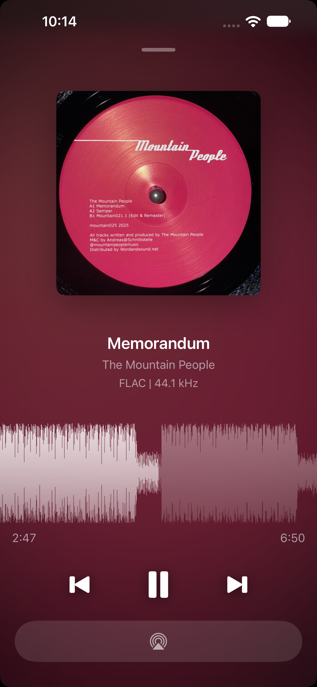
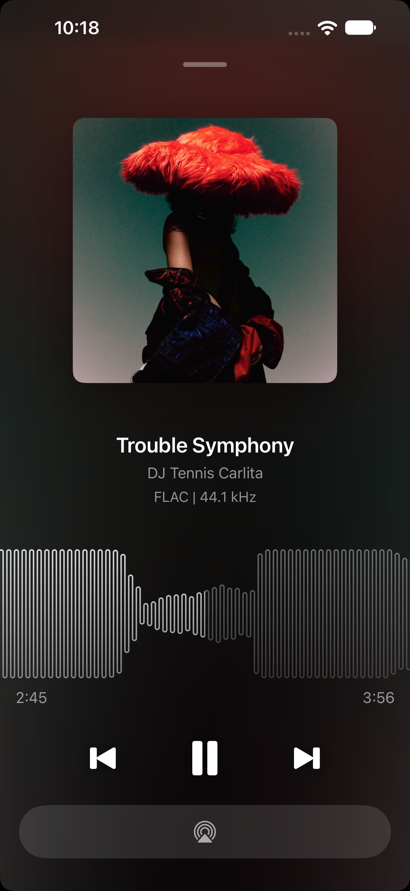
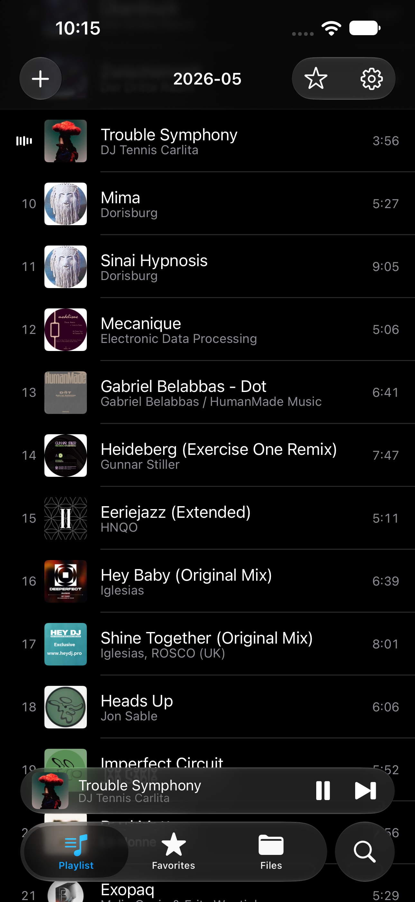

# Vibe

A fast, minimal player for your music files, on the Mac and on iPhone and iPad. No third-party engine, no account, no subscription. Play the music you already have, wherever you keep it. 

**[vibeplayer.app](https://vibeplayer.app)** — website, downloads, and [privacy policy](https://vibeplayer.app/privacy).


[](https://apps.apple.com/us/app/vibe-music-player/id1582482361?mt=12)

## Features

- **Formats** — MP3, MP2, AAC, FLAC, MP4/M4A, QTA (Voice Memos), AIFF and WAV, all decoded natively by CoreAudio
- **Waveform seek bar** — a SoundCloud-style waveform; click it to seek
- **Drag and drop** — drop files or folders on the window or the dock icon to play them
- **Metadata and artwork** — read with TagLib, then cached to disk
- **Keyboard transport** — `Space` plays and pauses, `B` and `N` change track, `A`–`D` and `Z`–`C` skip by bars
- **Performance FX** — a low-kill filter, a reverb wash and BPM-synced delays on `Q`–`T`; tap to latch, hold for momentary
- **Pitch adjust** — an optional SL-1200-style pitch fader
- **Themes** — restyle the whole player; build your own in Settings and share it as a file
- **Bit-perfect output** — Settings > General: Vibe sets the DAC to each file's sample rate and bit depth, offers optional exclusive access while playing, and shows a lock in the header while the track is delivered unchanged


## Usage

Drop audio files or a folder on the window to play them. Click the waveform to seek.

Drag the artwork out to copy the playing file somewhere else.

Settings > General > Load last playlist on launch saves the playlist when Vibe quits and brings it back next time, paused on the last track. Off by default.

### Key commands

| Key | Action |
| --- | --- |
| `Space` | Play / pause |
| `B` | Previous track |
| `N` | Next track |
| `A` / `S` / `D` | Skip forward 8 / 16 / 32 bars when the tempo is known, else 10 / 30 / 60 seconds |
| `Z` / `X` / `C` | Skip back 8 / 16 / 32 bars when the tempo is known, else 10 / 30 / 60 seconds |
| `Tab` | Show / hide playlist |
| `P` | Show / hide pitch control |
| `⌘O` | Open file or folder |
| `⌘S` | Save the playlist as an M3U file |

#### FX

| Key | Action |
| --- | --- |
| `Q` | Low-kill filter |
| `W` | Low-kill boost, which pushes the `Q` cutoff higher |
| `E` | Reverb wash |
| `R` | Delay, 1/8-note taps |
| `T` | Delay, 1/16-note taps |

Tap an FX key to latch the effect; hold it for momentary.

### Themes

Vibe ships with several built-in themes, and you can make your own in
**Settings > Appearance**: start from the current look (or duplicate a
built-in), then edit the window, fonts, colors, waveform, playlist, and even
the no-artwork placeholder — changes apply live. Themes export as a single
file (including any custom artwork) that anyone can import, so they're easy
to share. See [docs/themes.md](docs/themes.md) for the full guide.


## On iPhone and iPad

The same engine and the same file handling, in a shape that suits a phone. One
App Store listing covers both, free on each.

<p>



</p>

- **Your files, wherever they are** — open a folder from the Files app, iCloud
  Drive, Dropbox or anywhere else a Files provider reaches, in place and
  without copying. There is no library to import into
- **The same waveform** — drag it to scrub; set its theme to Album Art and it
  takes each track's own colours
- **Favorites** — star a folder to reopen it in a tap, and search across every
  folder you have given Vibe
- **Home-screen widgets** — small and medium, with the artwork, a live
  waveform, transport buttons, and tap-to-seek
- **Background audio** — Lock Screen and Control Center transport, and
  playback with the screen off

The Mac-only features are the ones that need a Mac: BPM and key analysis, the
pitch fader, the performance FX, the theme editor and FLAC conversion.

# Development

Vibe is written in Objective-C/C++ and is focused on performance and speed. It uses CoreAudio directly
and avoids 3rd-party libraries where possible. TagLib 1.3 is included in-tree and used for reading 
metadata and artwork.

`Vibe.xcodeproj` is generated by [XcodeGen](https://github.com/yonaskolb/XcodeGen) from `project.yml` and is not checked in, so a fresh clone has no project to open:

### Setup

```bash
brew install xcodegen
```

### Build 

```bash
xcodegen generate 
open Vibe.xcodeproj
```

Build and run the `Vibe` scheme with ⌘R. Re-run `xcodegen generate` after every pull or edit to `project.yml`.

Requirements, the `make` targets for building and testing from the command line, and the house rules are in [CONTRIBUTING.md](CONTRIBUTING.md).

- **Localization** — adding a string, adding a language, testing one: [docs/localization.md](docs/localization.md)
- **Releasing** — credentials, localized product-page assets, metadata upload, shipping a build: [docs/app-store-releasing.md](docs/app-store-releasing.md)

# License

Vibe is licensed under the [Apache License 2.0](LICENSE).

There is no package manager: all third-party code is vendored under `Vibe/ThirdParty/` and compiled into the app target. [THIRD-PARTY-NOTICES.md](THIRD-PARTY-NOTICES.md) lists every component and the license it is used under — most notably TagLib, which is dual-licensed and which Vibe uses under the Mozilla Public License 1.1 rather than the LGPL, because it is statically linked.
