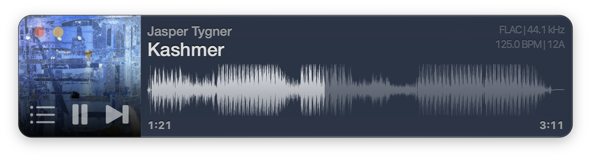
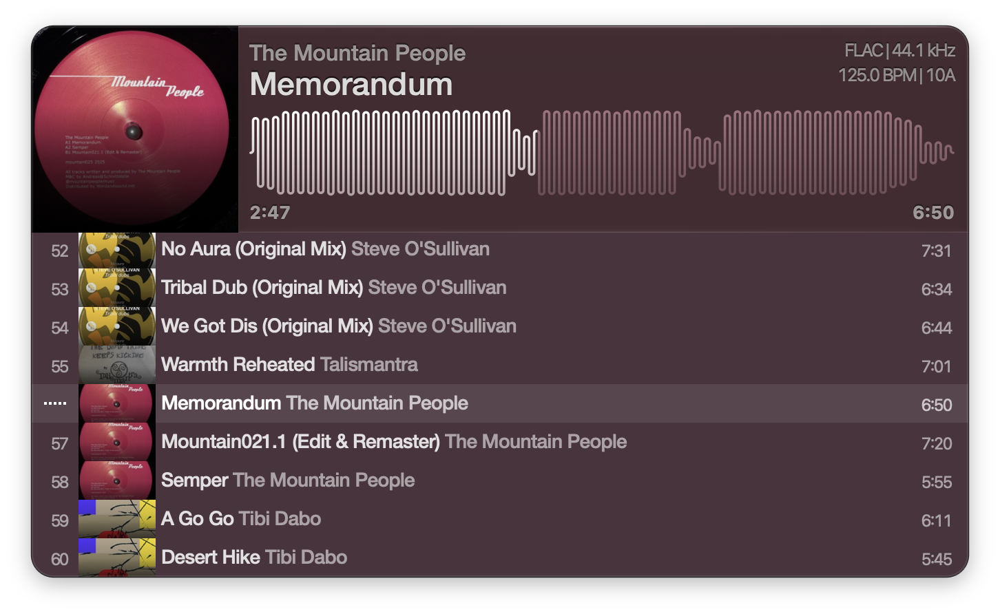
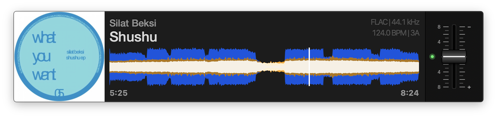
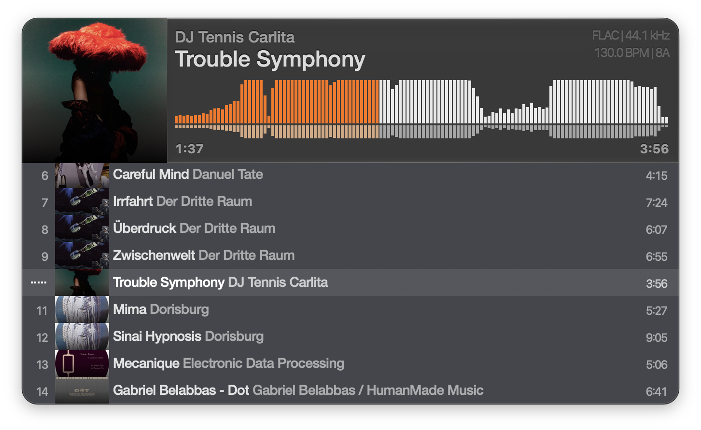
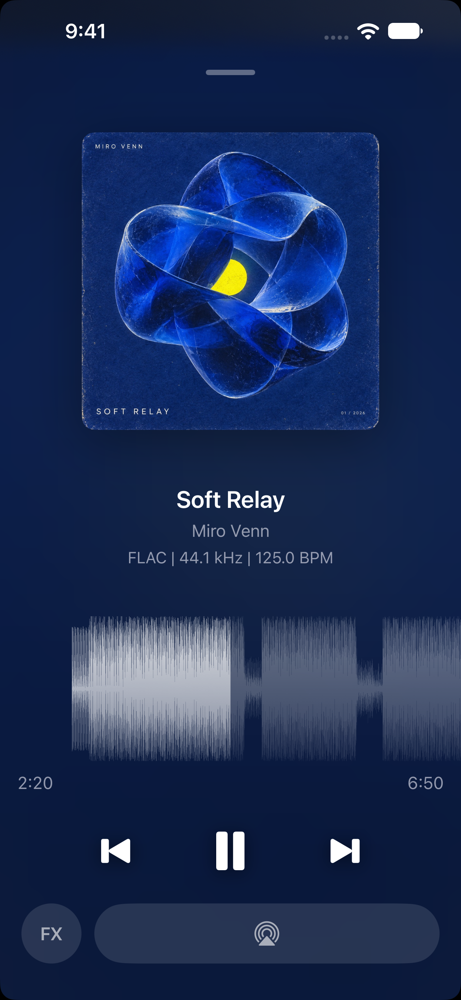
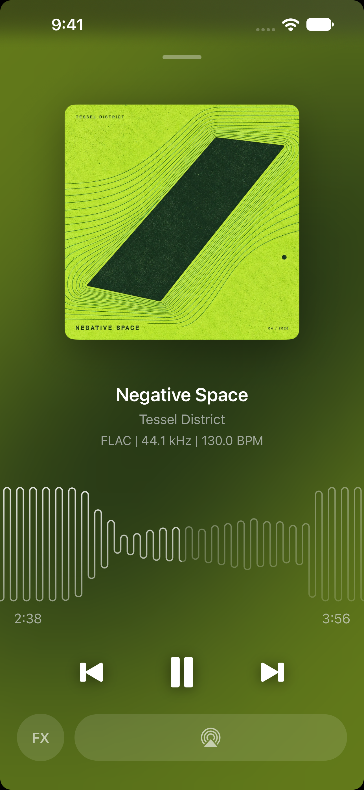
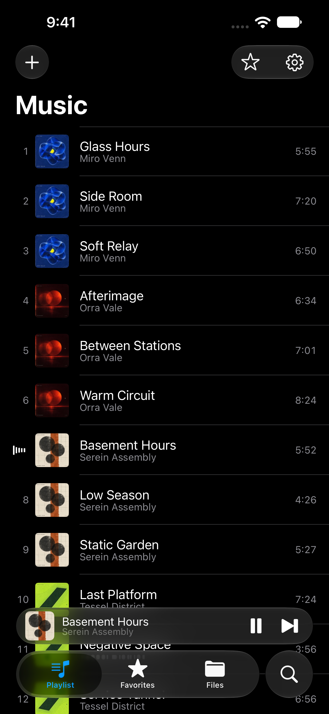

# Vibe

A fast, minimal player for your music files for the Mac, iPhone, and iPad. No third-party engine, no account, no subscription.



Website: **[https://vibeplayer.app](https://vibeplayer.app)**

## Download

[](https://apps.apple.com/us/app/vibe-music-player/id1582482361?mt=12)
[](https://apps.apple.com/us/app/vibe-music-player/id1582482361)

Latest release: [Vibe for Mac (.dmg)](https://vibeplayer.app/download/latest)

[Homebrew](https://brew.sh):

```bash
brew install cmicali/tap/vibe
```

## Features

- **Waveform view** — every track drawn as a full waveform across the window; click anywhere on it to seek
- **Fast** — built to be small and fast; tags, artwork, and waveforms are read in the background and cached, so the next open is instant
- **Custom audio engine** — MP3, MP2, AAC, FLAC, ALAC, MP4/M4A/M4B, QTA (Voice Memos), AIFF, WAV, W64, CAF, Ogg Opus, and Ogg Vorbis (Mac only), played through Vibe's custom CoreAudio engine with high-quality sample-rate conversion
- **Bit-perfect output** — bit-perfect and exclusive modes send audio to your output device exactly as-is
- **No library to import** — drop a file or a folder from your disk, iCloud Drive, or Dropbox and it plays; no database to rebuild, no library to manage
- **DJ tools** — turntable-style pitch control, BPM and key analysis, bar-accurate skips, and performance FX
- **Themes** — restyle the whole player; build your own in Settings and share it as a file
- **Speaks 30 languages** — fully localized, from Bulgarian to Vietnamese

<p align="center">
  
</p>

## Usage

Drop audio files or a folder on the window to play them, and click the waveform to seek. Drag the artwork out to copy the playing file somewhere else.

### Key commands

These are the defaults; every one can be changed in **Settings > Keyboard Shortcuts**. The single-letter keys follow their position on the keyboard, so they stay put under AZERTY, Dvorak, or a non-Latin layout.

| Key | Action |
| --- | --- |
| `Space` | Play / pause |
| `B` | Previous track |
| `N` | Next track |
| `A` / `S` / `D` | Skip forward 8 / 16 / 32 bars when the tempo is known, else 10 / 30 / 60 seconds |
| `Z` / `X` / `C` | Skip back 8 / 16 / 32 bars when the tempo is known, else 10 / 30 / 60 seconds |
| `Tab` | Show / hide the playlist |
| `P` | Show / hide pitch control |
| `⌘O` | Open a file or folder |
| `⌘S` | Save the playlist as an M3U file |


<p align="center">
  
</p>

### FX

Tap an FX key to latch the effect; hold it for momentary.

| Key | Action |
| --- | --- |
| `Q` | Low-kill filter |
| `W` | Low-kill boost, which pushes the `Q` cutoff higher |
| `E` | Reverb wash |
| `R` | Delay, 1/8-note taps |
| `T` | Delay, 1/16-note taps |

### Themes

Vibe ships with several built-in themes, and you can make your own in **Settings > Appearance**: start from the current look (or duplicate a built-in), then edit the window, fonts, colors, waveform, playlist, and even the no-artwork placeholder — changes apply live. Themes export as a single file (including any custom artwork) that anyone can import, so they're easy to share. See [docs/themes.md](docs/themes.md) for the full guide.

<p align="center">
  
</p>

## On iPhone and iPad

The same engine and the same file handling with Dropbox integration. The interface is native iOS, while the waveform rendering, audio engine, tag and file handling, and more are shared with the Mac app.

<p align="center">
  
  
  
</p>

## Audio quality and performance

Vibe tries to be as fast as possible while keeping the highest possible audio quality.

- **Audio quality guide** — [docs/audio-quality.md](docs/audio-quality.md)
- **Performance tracking** — [docs/performance.md](docs/performance.md)

## Development

Vibe is written in Objective-C/C++ and is focused on performance and speed. It uses CoreAudio directly and avoids third-party libraries where possible. TagLib 2.3 is included in-tree and used for reading metadata and artwork.

`Vibe.xcodeproj` is generated by [XcodeGen](https://github.com/yonaskolb/XcodeGen) from `project.yml` and is not checked in, so a fresh clone has no project to open until you generate it:

```bash
brew install xcodegen
xcodegen generate
open Vibe.xcodeproj
```

Build and run the `Vibe` scheme with ⌘R. Re-run `xcodegen generate` after every pull or edit to `project.yml`.

Requirements, the `make` targets for building and testing from the command line, and the house rules are in [CONTRIBUTING.md](CONTRIBUTING.md).

- **Localization** — adding a string, adding a language, testing one: [docs/localization.md](docs/localization.md)
- **Releasing** — credentials, localized product-page assets, metadata upload, shipping a build: [docs/app-store-releasing.md](docs/app-store-releasing.md)

## License

Vibe is licensed under the [Apache License 2.0](LICENSE).

There is no package manager: all third-party code is vendored under `Vibe/ThirdParty/` and compiled into both app targets. [THIRD-PARTY-NOTICES.md](THIRD-PARTY-NOTICES.md) lists every component and the license it is used under — most notably TagLib, which is dual-licensed and which Vibe uses under the Mozilla Public License 1.1 rather than the LGPL, because it is statically linked.
