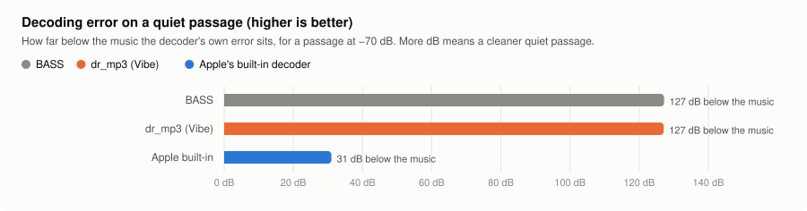
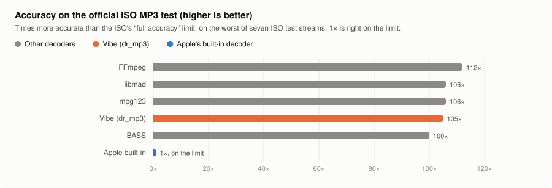
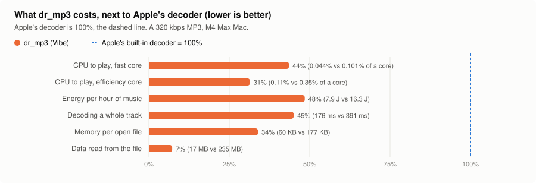
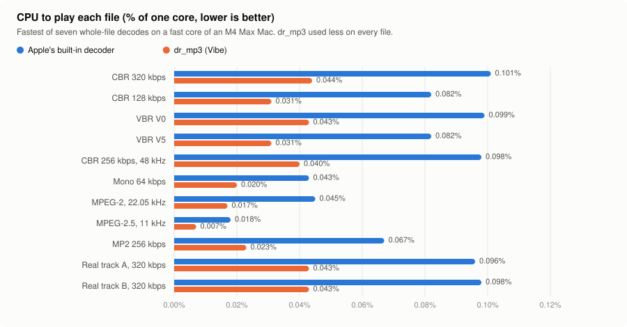

# Audio quality

This page explains what Vibe does to your music between the file and your speakers or DAC, what it never does, and how we know. Every number comes from an automated test that runs on every change, or from a measurement described next to it.

## The short version

- **Vibe does not change your audio unless it has to.** At full volume, with the pitch fader at 0% and no DJ effect in use, the samples that reach the output are exactly the samples decoded from the file. Turning the effects on without using them changes nothing: an effect that is not in use is removed from the audio path completely.
- **The one thing Vibe must sometimes change is the sample rate.** If a file's sample rate is different from your output's (a 44.1 kHz file on a 48 kHz output, say), Vibe converts it. It uses r8brain-free-src, which measured better than Apple's own converter on every test and uses a fraction of the CPU.
- **Bit-perfect output (macOS) avoids even that.** Vibe switches your device to the file's sample rate and to a format with enough bits, so the DAC receives the file's samples untouched.
- **Vibe never cuts lossy files down to 16 bits.** An AAC file decodes to more detail than 16 bits can hold, and Vibe keeps it.
- **MP3s use Vibe's own decoder, dr_mp3.** On Apple silicon, Apple's built-in MP3 decoder can only produce 16-bit sound. dr_mp3 keeps the full detail, is about 100 times more accurate on the official MP3 test, and uses less than half the CPU. On an Intel Mac, Apple's decoder keeps the full detail too, but it still chops off a loud master's peaks. See [The MP3 decoder](#the-mp3-decoder).
- **FLAC files use dr_flac.** The sound is identical to Apple's decoder, bit for bit. But where Apple's decoder can pause for a second or two on the first seek into a long mix, dr_flac seeks in a few milliseconds. It also uses a quarter of the CPU or less, and plays some rare FLAC files Apple's can't. See [The FLAC decoder](#the-flac-decoder).
- **WAV and AIFF files use dr_wav.** The sound is identical to Apple's decoder, bit for bit, and it decodes 1.4 to 3.2 times faster. It also seeks exactly in the one compressed AIFF format where Apple's decoder doesn't, and keeps playing past damage in the compressed WAV formats. See [The WAV and AIFF decoder](#the-wav-and-aiff-decoder).

## A few terms

- **Sample rate**: how many samples per second a recording has, such as 44.1 kHz (CD) or 96 kHz.
- **Bit depth**: how finely each sample is measured. 16 bits is CD quality; 24 bits and 32-bit float are finer. More bits means a lower noise floor.
- **Decoder**: the part that turns a compressed file, such as an MP3 or AAC, back into sound samples.
- **Resampling**: converting audio from one sample rate to another. Doing it well takes careful filtering; doing it badly adds noise, distortion and false tones.
- **dB and dBFS**: a way of measuring levels. 0 dBFS is the loudest a digital signal can be. Each −20 dB is ten times quieter, so −140 dB is ten million times quieter than the music. Most of the errors measured here are far below anything you can hear; the numbers show which method is *more exact*.
- **Aliasing**: false tones that appear when sound above the new sample rate's limit is not filtered out. A good resampler removes them.

## Where the audio goes

<picture><source media="(prefers-color-scheme: dark)" srcset="audio-quality/signal-path-dark.svg"></picture>

Every file is first decoded to 32-bit floating point. After that, each dashed step in the diagram only runs when it is needed. When it is not needed, it is skipped entirely. It does not "process at 100%"; the audio simply does not go through it.

- **Resample**: only when the file's sample rate is different from the output's.
- **Declick**: a 10-millisecond fade when you start, pause, seek or stop, so you never hear a click. It never touches the music in between. You can turn it off in Settings > Audio > Declick, and then those moments become clean cuts. A crossfade between tracks, if you turn one on, is the only longer fade.
- **Pitch**: only runs while the pitch fader is away from 0%. At 0% it is removed. We remove it rather than set it to "normal speed" because Apple's pitch processor still changes the samples slightly even at normal speed. The fader clicks into exactly 0% at its center.
- **DJ effects**: each effect only runs while you are using it, or while its echo or reverb is still dying away. Then it is reset and removed. When you release the low cut, it glides down, turns itself flat so there is no jump in sound, and a quarter of a second later is removed completely. We had a bug where a released low cut stayed in the path and slightly boosted the deep bass; a test now prevents that.
- **Volume**: Vibe's own volume fader. At full volume it does nothing at all.

The equalizer bars read a copy of the output. They never change it.

### Regular output

Vibe plays at whatever sample rate your output device is currently set to. A file at a different rate is converted once, by r8brain. The DJ effects and pitch fader are available. After Vibe, macOS mixes in any other apps' sound, converts to your device's format, and applies the system volume.

### Bit-perfect output (macOS)

Turn it on in Settings > Audio > Bit-perfect output. It is remembered for each device, and it needs a specific device chosen, not "System Output". Before each track plays, Vibe sets up your device:

- **The sample rate is set to the file's.** If your device can't run at that rate, Vibe uses the lowest exact multiple it can (a 44.1 kHz file on a device that only offers 88.2 kHz is doubled, cleanly). If there is no multiple either, it plays at the device's own rate, and the status says it is not bit-perfect.
- **The format is set to one with enough bits for the file.** A 16-bit file gets 16 bits, or 24 bits if the device has no 16-bit mode; that is still exact, because the extra bits are just zeros. A floating-point file gets a floating-point format. Files with more detail than 24 bits (32-bit integer or 64-bit float files, which are rare) are played at 24-bit precision, and the status says so.
- **Nothing else touches the audio.** The DJ effects and pitch fader are turned off. Crossfades are limited to the 10 ms declick, and with Declick off there is no fade at all.
- **Exclusive output** (a separate switch) locks the device so no other app can play through it at the same time.

The caption under the switch tells you whether the current track really is bit-perfect, and the format your device is using. If it isn't, it gives the reason: the sample rate, a change in the number of channels, a device that can't take the file's bit depth, a muted device, a volume below full (Vibe's, the system's, or the balance), another app holding the device, or a lossy file (which is decoded before it can be played, so it can't be "bit-perfect" to the file itself).

Only direct connections can be bit-perfect: built-in audio, USB, FireWire, Thunderbolt, PCI, HDMI, DisplayPort, AVB and virtual devices. Bluetooth and AirPlay can't, because they re-compress the audio, and neither can aggregate devices.

### iOS

On iPhone and iPad, iOS decides the output's sample rate based on where the sound is going (the speaker, headphones, a USB DAC). Vibe converts to that rate with r8brain when needed, and otherwise works like regular output. There is no bit-perfect mode on iOS.

## Lossy files and bit depth

**MP3 and AAC files don't have a bit depth.** They store the sound in a compressed form, and the decoder rebuilds the waveform when you play it. Some players send MP3s to the DAC as 16-bit on the idea that "MP3s are 16-bit". But a decoder that works at full precision produces more detail than 16 bits can hold, and its loudest moments can go slightly above the digital maximum. Cutting that down to 16 bits adds noise, and chopping off the peaks adds distortion.

So in bit-perfect mode, Vibe gives lossy files your device's floating-point format if it has one, and otherwise its highest bit depth. It never picks 16 bits just because a file is lossy.

How much that matters depends on the decoder. Apple's built-in decoders behave very differently:

| Apple's decoder | What it can output | Samples that fit exactly in 16 bits | Peaks above the maximum (a loud master) | What sending it as 16-bit would do |
| --- | --- | --- | --- | --- |
| AAC | 32-bit float or 16-bit (Vibe asks for float) | 0.04% | kept: up to +0.79 dBFS | add a layer of noise (at −101 dBFS) and chop off every peak |
| MP3 and MP2, Apple silicon | 16-bit only | 100% | chopped off by the decoder itself | nothing, played unchanged: the decoder already made it 16-bit |
| MP3 and MP2, Intel | 32-bit float or 16-bit (Vibe asks for float) | 0.03% | chopped off by the decoder itself, at exactly the maximum | add a layer of noise (at −101 dBFS) |

**AAC** is the format of iTunes purchases, Apple Music downloads and most lossy files on Apple devices, and it is where this choice matters. A floating-point output keeps the decoded AAC exactly, peaks and all. A 24-bit output keeps everything within the maximum level, with any change far below hearing (at −149 dBFS), but like any integer format it still chops off the peaks above the maximum; only floating point keeps those. A 16-bit output would add noise that sits only 33 dB below a quiet fade-out, compared with 81 dB below at 24 bits.

**MP3 and MP2** are different with Apple's decoder on Apple silicon, which is why Vibe no longer uses it by default:

- **On Apple silicon, Apple's MP3 decoder can only produce 16-bit samples.** It rounds the audio to 16 bits and chops off any peaks above the maximum before Vibe receives it. There is no setting to ask it for more; we checked what it offers, and a test now checks it on every build.
- **Asking for floating-point output doesn't change that.** A common tip says you can get full-precision MP3s from Apple by requesting 32-bit float output (through `ExtAudioFile` or `AudioConverter`). It works on an Intel Mac (see below), but not on Apple silicon, where we tried both. You do get floating-point numbers back, but every one of them is still a 16-bit value, and the loud peaks are still chopped off at the maximum. Core Audio converts the decoder's 16-bit output to float after the fact; it can't restore what was already rounded away. Vibe already requests float output for every file, which is what keeps AAC's full detail.
- **So on Apple silicon, with Apple's decoder, the output format makes no difference for MP3 in bit-perfect mode.** When Vibe plays the decoded samples unchanged (at the file's own sample rate, full volume, no effects), 16-bit, 24-bit and floating-point outputs all carry exactly the same samples.
- **On Apple silicon, the only way to get more out of MP3s is a different decoder, and Vibe uses one.** A full-precision decoder keeps the detail below 16 bits (only 0.03% of its samples fit exactly in 16 bits) and the peaks (up to +0.49 dBFS on the same file). With it, MP3s behave like AAC: a floating-point output keeps everything. See [The MP3 decoder](#the-mp3-decoder).
- **On an Intel Mac, Apple's decoder keeps the detail but not the peaks.** Its Intel version also offers 32-bit float output, which Vibe asks for, so the detail below 16 bits survives: 0.03% of its samples fit exactly in 16 bits, and it matches dr_mp3 to within 0.06 of a 16-bit step. But it still cuts every peak above the maximum down to exactly the maximum. dr_mp3 keeps those peaks, so it is the default on Intel Macs too.

*How this was measured:* we made a test track that behaves like mastered music: tones and noise at CD quality (16-bit, dithered), loud for ten seconds with peaks just under the maximum, then fading out to −70 dB. A second, louder version was squashed right up to the maximum, like a modern loud master. We encoded them as MP3 (LAME at 320 kbps and V2) and AAC (Apple's encoder at 256 kbps), then decoded them the way Vibe does, and with ffmpeg for comparison. The Intel figures come from Vibe's own test files (MP3 at 192 kbps, V2 and a loud 320 kbps master, plus MP2), decoded under Rosetta 2, which runs the Intel version of Apple's decoder on an Apple silicon Mac. We haven't checked them on an Intel Mac itself.

## The MP3 decoder

Vibe decodes MP3 and MP2 files with its own decoder, **dr_mp3**, not the one built into macOS and iOS. On the Mac you can switch back in Settings > Advanced > MP3 decoder, which offers "Vibe (dr_mp3 HQ)", the default, and "Apple built-in". A change applies from the next track: a file already playing keeps its decoder, and the next track, which Vibe opens early, is opened again. The iPhone always uses dr_mp3.

### Why not Apple's decoder

On Apple silicon, Apple's MP3 decoder can only produce 16-bit samples, as the section above explains. That costs three things:

- **Quiet passages lose detail.** Rounding to 16 bits adds a thin layer of noise. On loud music it is far below hearing. On a quiet passage, it sits much closer to the music: for a passage at −70 dB, Apple's error is only 31 dB below the music, while dr_mp3's is 127 dB below (BASS's too).
- **Loud masters lose their peaks.** A modern, loud master decodes slightly above the digital maximum. Apple's decoder chops those peaks off: 36,188 samples on our 20-second test master. dr_mp3 keeps them (up to +0.93 dB), so Vibe's volume control, effects or resampler can bring them back down cleanly instead of distorting them.
- **Some songs lose their last moment.** In an MP3 without gapless information, the last 529 samples (about 12 milliseconds) come from the decoder emptying itself. Apple's decoder fills them with silence; dr_mp3 plays them. If the music runs to the very end of the file, Apple's version ends with a small click.

On an Intel Mac, Apple's decoder keeps the quiet detail, but the other two costs remain.

<picture><source media="(prefers-color-scheme: dark)" srcset="audio-quality/mp3-quiet-dark.svg"></picture>

### Accuracy on the official test

MP3 has an official accuracy test from the ISO, the standards body behind the format (ISO/IEC 11172-4). It comes with test recordings and the exact output a perfect decoder should give. A decoder passes at "full accuracy" if its average error stays under a set limit. That limit is exactly the size of 16-bit rounding, so a decoder with 16-bit output, like Apple's on Apple silicon, lands right on it.

We ran seven of the ISO test recordings through six decoders. The chart shows how many times inside the limit each decoder stays, on its worst recording, best first. **Higher is better.**

<picture><source media="(prefers-color-scheme: dark)" srcset="audio-quality/mp3-accuracy-dark.svg"></picture>

- **dr_mp3 is about 105 times inside the limit.** Apple's decoder on Apple silicon is right on it: "full accuracy" on three recordings and only "limited accuracy" on the other four.
- **On an Intel Mac, Apple's decoder is a full-precision decoder too.** Under Rosetta 2, which runs its Intel version, it reaches full accuracy on all seven recordings and is 150 times inside the limit on its worst, `compl`. It is level with dr_mp3 on `si` and slightly ahead of it on the other six.
- **Every decoder with full-precision output is equally accurate.** The small differences between FFmpeg, libmad, mpg123, dr_mp3 and BASS are about as large as the rounding in the ISO's own reference files, so the test can't rank them any further.
- **BASS is dr_mp3's close cousin.** BASS is a commercial audio library, and its notes say its MP3 decoding is based on minimp3, the same decoder dr_mp3 comes from. Its output matches dr_mp3's to within the last bit or two of a 32-bit float, about −134 dB. It keeps a loud master's peaks too.
- **libmad has no edge any more.** It is famous for topping an older version of this comparison, from the early 2000s. Back then most decoders gave 16-bit output and libmad gave 24-bit. Against decoders with full-precision output, that advantage is gone.

The numbers behind the chart, plus Apple's decoder on an Intel Mac, best first. "Average error" is on each decoder's worst recording.

| Decoder | Average error | Largest single error | Times inside the limit | Result |
| --- | --- | --- | --- | --- |
| Apple built-in, Intel (under Rosetta 2) | −144.6 dBFS | 6.9e-7 | 150× | full accuracy on all 7 |
| FFmpeg (`mp3float`) | −142.1 dBFS | 7.2e-7 | 112× | full accuracy on all 7 |
| libmad 0.15.1b, accuracy build | −141.6 dBFS | 7.3e-7 | 106× | full accuracy on all 7 |
| mpg123 1.33.7 | −141.6 dBFS | 7.0e-7 | 106× | full accuracy on all 7 |
| dr_mp3 0.7.4 | −141.5 dBFS | 7.1e-7 | 105× | full accuracy on all 7 |
| BASS 2.4.18 | −141.1 dBFS | 6.9e-7 | 100× | full accuracy on all 7 |
| libmad 0.15.1b, default build | −140.2 dBFS | 9.2e-7 | 90× | full accuracy on all 7 |
| Apple built-in, Apple silicon | −100.8 dBFS | 2.4e-5 | 1× | full on 3, limited on 4 |

The limit for full accuracy is an average error below −101.1 dBFS and no single error above 6.1e-5. We read libmad at its full internal precision, finer than the 24-bit output it is known for. Apple and BASS both remove the decoder's 529-sample start-up delay, so their output was lined up 529 samples later. The recordings come from FFmpeg's test-file mirror; `compl`, a −20 dB sine sweep, is the one the well-known Underbit compliance table used.

A test runs this ISO check on every change and fails if dr_mp3 is ever less than 50 times inside the limit, so it would catch a slip back to 16-bit output. (The ISO's recordings aren't ours to include, so the test downloads them, and skips if it can't.)

### Speed and cost

dr_mp3 is also cheaper to run than Apple's decoder, on every measure except app size (it adds 48 KB of code). We timed BASS the same way, for comparison. Both charts put the cheapest first. **Lower is better** in both.

<picture><source media="(prefers-color-scheme: dark)" srcset="audio-quality/mp3-cost-dark.svg"></picture>

<picture><source media="(prefers-color-scheme: dark)" srcset="audio-quality/mp3-cpu-dark.svg"></picture>

- **Less than half the CPU.** Across 11 files, dr_mp3 used 2.5 times less CPU than Apple's decoder on the Mac's fast cores, and 3 times less on its efficiency cores. It won on every file. It does less work, not the same work faster: it runs 2 to 3 times fewer CPU instructions.
- **Both are very cheap.** Playing a 320 kbps MP3 takes about 0.1% of one core with Apple's decoder and 0.04% with dr_mp3. You won't feel the difference during playback. It shows up when a whole track is decoded at once, as for the waveform (2.2 times faster), and on slower cores.
- **About half the energy.** An hour of music costs 8.1 joules to decode with dr_mp3 and 16.8 with Apple's decoder. Both are tiny: a phone battery holds about 50,000 joules.
- **A third of the memory, and far less reading.** Each open file takes 60 KB with dr_mp3 and 177 KB with Apple's decoder. To play a 15 MB file, Apple's decoder read 235 MB from it and dr_mp3 read 17 MB.
- **BASS comes second.** It used about 15% more CPU than dr_mp3 on both kinds of core, and about half as much as Apple's decoder. dr_mp3 was cheaper on every file on the fast cores; on the efficiency cores the two were within 3% of each other on four of the eleven, which is inside those cores' run-to-run noise.

The whole comparison for a 320 kbps MP3, best first:

| Measure | dr_mp3 | BASS | Apple |
| --- | --- | --- | --- |
| CPU to play, fast core | 0.042% of one core | 0.050% | 0.096% |
| CPU to play, efficiency core | 0.12% | 0.14% | 0.32% |
| Energy per hour of music | 8.1 J | 9.6 J | 16.8 J |
| Decoding a whole 6.5-minute track | 161 ms | 188 ms | 361 ms |
| Opening a file | 0.06 ms | not measured | 0.09 ms |
| Seeking, then reading 4,096 frames | 0.15 ms | not measured | 0.17 ms |
| Slowest 4,096-frame read on a fast core, any file | 0.75 ms | not measured | 2.4 ms |
| Memory per open file | 60 KB | 30 KB* | 177 KB |
| Data read to play a 15 MB file | 17 MB | 15.7 MB* | 235 MB |
| Added to the app | 48 KB of code | a 0.9 MB library | nothing |

\* BASS reads the file itself, while both of Vibe's decoders share macOS's file reader, so these two aren't like for like. With a real track's embedded artwork, BASS also held 174–414 KB of tags in memory.

- **A read has plenty of time.** Each 4,096-frame read covers 93 ms of music, and the slowest took under 3 ms. On efficiency cores both decoders had rare reads of 45–77 ms, from the test's lowest thread priority waiting on a busy machine; the app's decode thread runs at the highest priority, and each track keeps at least a second of audio buffered.
- **Where dr_mp3's memory goes:** 23 KB of decoder state, about 21 KB for 16 compressed frames read ahead, and 9 KB for one frame of sound. The rest is macOS's file reader.
- **Why Apple's decoder reads so much:** it reads 64 KB at a time and rereads the same part of the file many times, 15 to 40 times the file's size over one playthrough. In our test the file was already in memory, so this cost time (about 10 ms per track, against 1–3 ms) and no disk reads. We didn't test a slow drive or a network share.

*How this was measured:* Vibe's own file reader with the app's Release build settings, switching between the two decoders run by run, on a Mac with an M4 Max. BASS 2.4.18 decoded the same files with its own file reader, in the same session. The files were one real 6.5-minute track encoded nine ways, plus two real 320 kbps tracks. No iPhone or Intel Mac was measured.

### How it fits in

- **macOS still reads the file.** It opens the file, reads its tags and gapless information, and finds each frame of audio. dr_mp3 only turns those frames into sound. So every track has the same length and plays gaplessly exactly as with Apple's decoder. On 16 test files the lengths matched exactly, and on Apple silicon the sound differed only by Apple's 16-bit rounding (at most 4 steps of a 16-bit value). With the Intel version of Apple's decoder, Vibe's six MP3 and MP2 test files differ by at most 0.06 of a step, apart from the peaks Apple chops off.
- **Same timing as Apple.** Every MP3 decoder outputs its sound 529 samples late (241 for MP1 and MP2). Apple's decoder removes this delay, so Vibe removes the same amount. At the end, Vibe feeds dr_mp3 one silent frame so it gives up its last samples instead of dropping them.
- **Seeking lands on the exact sample.** An MP3 frame can borrow data from the frames before it, so dr_mp3 starts at least ten frames before the target and throws them away. In the tiny frames of an 8 or 16 kbps MP3 the borrowing can reach much further back, as far as 80 frames in our 8 kbps tests, so there Vibe works out how far from the frames' sizes and starts that far back. A seek then gives exactly the same sound as playing from the start.
- **Damaged and cut-off files end where Apple's do.**
- **MP3 and MP2 inside WAV files work too.** macOS opens these only when every frame is the same size, which 48 kHz CBR is; it refuses 44.1 kHz and VBR ones with either decoder. Rare "free-format" MP3s are also refused by macOS before either decoder sees them.
- **MP2 now plays on the iPhone.** iOS has no MP2 decoder of its own, so MP2 files could never play there before. dr_mp3 decodes them.
- **A damaged frame is capped at +12 dB.** A badly damaged frame can make a loud click with either decoder. Apple's decoder caps it at full scale, as it caps every peak; dr_mp3 on its own doesn't, and one flipped bit in a frame's volume made it 96 dB louder than full scale. Through the effects' reverb and echo that one frame rang on at full scale for 9 seconds, it held the equalizer bars down for 29 seconds, and it moved the track's detected tempo from 123.0 to 119.3 BPM. So Vibe caps dr_mp3's output at +12 dB, four times full scale, well above any real peak: the loudest in 1,060 real MP3s, damaged ones aside, was +8.6 dB, and the one file that reaches the cap is damaged. With the cap, the same frame rang on for a tenth of a second, the bars dipped for under 4 seconds, and the tempo read 122.9.
- **Two fixes to dr_mp3 itself.** It misread frames with any of their "private bits" set, which encoders may use as they like, and 8 kHz files with a rare kind of frame, the mixed block, where it also wrote past the end of a buffer. Vibe's copy decodes both as FFmpeg and mpg123 do. Neither kind turned up in 1,065 real MP3s, and every one of them decodes exactly as before.
- **Not tested yet:** MP1 files (we have no MP1 encoder; dr_mp3 decodes them with MP2's timing, which MP1 shares), and CPU use on an iPhone.

### Tuning dr_mp3

Two changes to how Vibe feeds dr_mp3 were worth making, and together they cut the decode time by 13–18%:

- **Reading 16 frames at a time.** Asking macOS for one frame at a time made about four small file reads per frame, a tenth of the decode time. 16 at a time saved it; 4 saved half as much, and 64 no more than 16.
- **One Accelerate call to split stereo.** dr_mp3 gives left and right samples mixed together, and playback wants them apart. A single `vDSP_ctoz` call does that, saving about 3%.

What didn't help: build settings (`-O3`, what ships, was as fast as any; `-Os` is 8% slower and turning off dr_mp3's hand-written NEON code 16% slower), faster floating-point math, and Accelerate inside the decoder, whose transforms are too small to gain from it. About half the decode is reading the compressed bits, where each value depends on the one before, so no vector instructions can help.

### Why dr_mp3

We looked at every MP3 decoder we could use, best first:

- **FFmpeg, libmad and mpg123** are as accurate as dr_mp3, but their licenses (GPL and LGPL) don't fit an app sold on the App Store. libmad also hasn't been updated since 2004, and its memory-safety bugs (CVE-2017-8372, -8373 and -8374) are fixed only in Linux distributions' patches.
- **dr_mp3** is as accurate, cheaper to run than Apple's decoder or BASS, free to use (public domain, or the MIT No Attribution license), a single file, and maintained.
- **BASS** is as accurate too, but it is closed source, needs a paid license, and used more CPU than dr_mp3.
- **minimp3** is the decoder dr_mp3 and BASS are built on. Its decoding is the same as dr_mp3's, but it hasn't been updated since 2022.
- **Helix MP3** has an awkward license, and **Symphonia** would add a Rust toolchain to the build.

Apple's decoder stays one setting away on the Mac.

## The FLAC decoder

Vibe decodes FLAC files with **dr_flac**, not the decoder built into macOS and iOS, on the Mac and the iPhone alike. The sound is the same: FLAC is lossless, and both decoders give back exactly the samples that were encoded. On all 1,394 FLAC files of a real library that Apple's decoder opens, dr_flac's output was identical to Apple's, bit for bit, and so was every seek. What changes is how it seeks, what it costs, and which files play. There is no setting, because there is no difference to hear.

### Why not Apple's decoder

- **Seeking.** Apple's decoder never uses a FLAC file's seek table. The first time you seek into a part of a track it hasn't read yet, it reads the whole file from the start up to that point, and the sound after the seek waits for it. Resuming a track where you left off is a seek too. dr_flac finds the spot in a few small reads, from the seek table or by bisecting the file.
- **A quarter of the CPU or less:** 4 to 7 times less than Apple's decoder, on the fast cores and the efficiency cores alike. Playing costs little either way; it shows when a whole track is decoded at once for the waveform, beat, and key analysis: 5.4 times faster on an efficiency core for a 24-bit, 96 kHz track.
- **It reads the file once.** Apple's decoder reads 2.4 to 5 times the file's size to play it.
- **A fraction of the memory:** about 100 KB per open file, against 1.3 to 2.8 MB for Apple's decoder.
- **Files Apple's decoder refuses play.** These are legal FLAC files that some encoders write: block sizes of 16 or 65,535, sample rates above 655 kHz (such as 705.6 kHz), and 32-bit files.
- **Files that don't say how long they are play.** An encoder writing somewhere it can't go back to, such as a pipe or a live recording, leaves the length out of the file. Apple's decoder then reports no length at all, so Vibe couldn't play these files. dr_flac works the length out from the last moments of the file, reading only its end, so they play, show their duration, and seek as fast as any other.
- **Damaged files keep playing.** At the first damaged frame, Apple's decoder ends the track, as though it were over, and Vibe moves on to the next one. dr_flac plays silence in place of the damaged frame, the length of that frame, and carries on with every other frame where it belongs. A file cut short, such as an unfinished download, ends at the same place with both.
- **The last moment of a file with an ID3v1 tag.** Apple's decoder drops the file's last frame (about 30 ms) when an ID3v1 tag follows it. dr_flac plays it.

The seek that waits, measured with the file read from the SSD rather than from memory. **Lower is better.**

| First seek | dr_flac | Apple |
| --- | --- | --- |
| To the middle of a 4-minute track (27 MB) | 0.9 ms | 51 ms |
| To 90% of it | 1.4 ms | 93 ms |
| To the middle of a 77-minute mix (604 MB) | 2.6 ms | 1.16 s |
| To 90% of it | 2.7 ms | 2.11 s |
| Any later seek, over 1,500 on five files | 2.1 ms at most | 0.2–0.3 ms, or a scan again past the part already read |

The whole comparison, best first, **lower is better**. The ranges run across thirteen real tracks, 16 and 24-bit, 44.1 to 192 kHz:

| Measure | dr_flac | Apple |
| --- | --- | --- |
| CPU to play, fast core | 0.022–0.10% of one core | 0.086–0.58% |
| CPU to play, efficiency core | 0.057–0.41% | 0.26–1.9% |
| Decoding a whole 3-minute, 24-bit, 96 kHz track, efficiency core | 0.30 s | 1.59 s |
| Decoding a whole 4-minute, 16-bit track, fast core | 55 ms | 230 ms |
| Data read to play a file | its size, once | 2.4–5.1 times its size |
| Memory per open file | 54–98 KB | 1.3–2.8 MB |
| Opening a file | 0.3–0.5 ms | 0.5–0.8 ms |
| Slowest 4,096-frame read, fast core | 0.08 ms | 0.85 ms |
| Added to the app | 118 KB of code | nothing |

*How this was measured:* Vibe's own file reader with the app's Release build settings, as it is now and as it was before dr_flac, run by turns, on a Mac with an M4 Max that other work was also using, so each figure is the best of five runs. The library was 1,397 FLAC files from ordinary sources (CD rips, web stores, downloads, sample packs). Every one but three empty files was decoded in full by both decoders and compared sample by sample, with 25 seeks each compared too. "Read from the SSD" means a fresh copy of the file, none of it in memory. No iPhone was measured.

### What we fixed in dr_flac

dr_flac had problems of its own. Most turned up in real files from that library, and the rest in test files made for the rarer cases (32-bit files, damaged frames, files that don't say how long they are). Vibe's copy fixes them, and the fixes are being offered back to its author:

- **A tag in front of the music.** Some taggers put an ID3v2 tag before the FLAC data. dr_flac read the file from the wrong place and played noise, cut the track short, or refused it (17 files, 1.2%).
- **Seeks that failed.** A kind of frame that encoders legally write could be decoded but not skipped over, so some seeks failed and would have stopped the track with an error (33 files, 2.4%).
- **A seek table that is out of date.** A file edited after it was encoded can keep a seek table that points at the wrong frames. dr_flac trusted it and landed up to 0.85 s early. It now checks where it actually landed.
- **Seeks that read the whole file.** On a file without a seek table (39% of the library), a few percent of seeks read most of the file, up to 1.9 s on the 77-minute mix. The search was rewritten, and no seek now takes more than a few milliseconds.
- **Damaged frames.** dr_flac skipped a damaged frame, so everything after it played early, or stopped the track. It now plays silence in its place.
- **Seeking into a cut-off file.** A seek past the end of an unfinished download failed. It now lands at the end, and the next track plays.
- **32-bit files,** which dr_flac could open but not play, and **files that don't say how long they are**, where every seek went back to the start. dr_flac now finds such a file's length when it opens it, from the end of the file.
- **Files made with an encoder's most extreme settings.** Told to ignore the limits that keep a file easy to stream, an encoder can split each frame's data into more than 256 parts. That is still a valid FLAC file, but dr_flac took every such frame for damage and played silence. Apple's decoder stops partway through the same files.
- **Seeks in very long files.** A seek that jumped more than about 6 hours at 192 kHz (27 hours at 44.1 kHz) from inside a frame stayed in that frame.

A review of dr_flac with those fixes in place, with fuzzing and simulated damage, found more, some in our own fixes:

- **More kinds of damage.** A frame missing a few bytes also took the intact frame after it, and one time in 256 any damaged frame did. A damaged first frame made the whole track play a frame early. A rare corrupted header could add minutes of silence, and a file cut off inside a frame sometimes ended with a frame of silence. On 1,200 simulated damaged library files, every undamaged frame now plays in its place, except in one file whose damage erased its last frames. Before, 181 of them (15%) lost or moved an undamaged frame.
- **Seeks near damage.** A seek to a damaged frame that the seek table points at landed 93 ms late, and the slower ways of seeking missed the frames lost to damage. Every way of seeking now lands where playing from the start would.
- **Seek tables with garbage in them, and unfinished downloads.** One flipped bit in a seek table could stall a seek for five seconds. It now takes under a millisecond. Seeking into the empty end of a download that reserved its full size took 1 to 2.5 seconds, and now takes about 0.2.
- **Crashes and undefined behavior**, all in rare or damaged files. A file that doesn't say how long it is could crash when read to its end and then seeked back into. Damaged 32-bit files, and invalid files made by fuzzing, ran into arithmetic that C leaves undefined.

### Tuning dr_flac

Two changes to dr_flac itself halved the work of decoding: across 17 library files, 16 and 24-bit, 44.1 to 192 kHz, it takes 51% fewer CPU cycles than before, and every file came out between 49% and 53% cheaper. The output is unchanged, bit for bit, on every file of the library. With these and the fixes above, dr_flac is 118 KB of code, where upstream's is 80 KB.

- **The checksum, eight bytes at a time.** Every FLAC frame carries a checksum, which dr_flac worked out one byte at a time, each step waiting for the one before. The plain C spent a fifth of a 16-bit file's decoding time on it, and half of a 24-bit file's. Tables that let eight bytes be worked on at once cut it to 2%.
- **Vibe's own NEON code.** dr_flac has hand-written code for the Mac's and iPhone's vector instructions (NEON), which on Apple Silicon was slower than its plain C: 60% slower on 16-bit files. Its way of predicting each sample kept the vector unit waiting on the sample before. Vibe's replacement keeps the few newest samples in ordinary registers and leaves the older ones to the vector unit. It is 23% faster than the plain C on 16-bit files, 20% on 24-bit, and twice as fast as what it replaced. It also covers the prediction orders above 12, which the old code left to the plain C.

What didn't help enough to keep: reading the file in 64 KB pieces instead of 4 KB saved another 4%, but costs 60 KB more memory per open file and a setting that two separate parts of the app would have to keep in agreement. Giving up early on a long run of zeros inside a frame, which only a damaged file has, sped up those files but slowed every normal file by 2%.

### How it fits in

- **macOS still opens the file** and reads its format and channel layout, so Vibe knows every FLAC file exactly as before. dr_flac then decodes it.
- **Same length, exact seeks, gapless.** A seek gives exactly the sound playing from the start does, and tracks still join seamlessly.
- **Bit-perfect output is unchanged.** A 16 or 24-bit file reaches the device as the file's own samples, as before.

## The WAV and AIFF decoder

Vibe decodes WAV, BWF, RF64, Wave64 and AIFF files with **dr_wav**, not the decoder built into macOS and iOS, on the Mac and the iPhone alike. That covers every coding they commonly hold: 8 to 32-bit integer samples, 32 and 64-bit float, A-law and µ-law, and the three ADPCM kinds (IMA and Microsoft's in a WAV, Apple's IMA4 in an AIFF). On all 10,823 WAV and AIFF files of a real library of music projects and sample packs that both decoders open, dr_wav's output was identical to Apple's, bit for bit, and so was every seek. A file holding anything else, such as MP3 or FLAC inside a WAV, the compressed AIFF that Ableton Live writes, or a Microsoft ADPCM file with a coefficient table of its own, is still decoded by Apple's decoder, as before. There is no setting.

### Why not Apple's decoder

- **Less time decoding:** 1.4 to 3.2 times faster than Apple's decoder, on the fast cores and the efficiency cores. Playing costs almost nothing either way; it shows when a whole track is decoded at once for the waveform, beat, and key analysis.
- **Exact seeks in IMA4.** In Apple's IMA4 (compressed AIFF), each part of the sound depends on everything before it. After a seek, Apple's decoder plays slightly different samples from the ones playing from the start gives: all 300 of 300 random seeks in a test file. dr_wav keeps notes on its way through the file and seeks to exactly the samples playing from the start gives.
- **Damaged compressed WAVs keep playing.** At a damaged block in an IMA ADPCM file, Apple's decoder decodes the block anyway, and at one in a Microsoft ADPCM file it plays nothing of the file at all. dr_wav plays silence for the damaged block and every other block where it belongs.
- **The end of a Microsoft ADPCM file.** Apple's decoder plays the padding that fills out the file's last block, 464 frames (about 10 ms) on a test file. dr_wav stops where the file says the sound ends.
- **24 and 32-bit little-endian AIFF.** Apple's decoder reads every such file as 16-bit and plays it wrongly, one and a half or two times as long as the music. dr_wav plays it.

A whole 10-minute stereo file decoded at once, best first, **lower is better**:

| File | dr_wav, fast core | Apple, fast core | dr_wav, efficiency core | Apple, efficiency core |
| --- | --- | --- | --- | --- |
| 16-bit, 44.1 kHz WAV | 10 ms | 21 ms | 53 ms | 116 ms |
| 24-bit, 96 kHz WAV | 33 ms | 68 ms | 154 ms | 371 ms |
| 24-bit, 96 kHz AIFF | 32 ms | 101 ms | 166 ms | 506 ms |
| 32-bit float, 96 kHz WAV | 39 ms | 54 ms | 172 ms | 282 ms |

The ADPCM formats are the exception: they take about as long as Apple's decoder, and IMA4 about 60% longer, a few milliseconds for 20 seconds of sound.

*How this was measured:* Vibe's own file reader with the app's Release build settings, as it is now and as it was before dr_wav, run by turns on a Mac with an M4 Max; each fast-core figure is the best of five runs, each efficiency-core figure the middle of three, since those runs vary more. The library comparison used a test program that opens files the way Vibe does, on 17,917 WAV and AIFF files from music projects, sample packs and the Ableton Live factory library. Every file both decoders open, 10,823 of them, was decoded in full by both and compared sample by sample, with 50 seeks each compared too. No iPhone was measured.

### What we fixed in dr_wav

dr_wav had problems of its own. Some turned up in real files from that library, some in test files made for the rarer cases, and the rest in a review with fuzzing and simulated damage. Vibe's copy fixes them, and the fixes are being offered back to its author:

- **Seeks in tagged AIFF files landed late.** dr_wav counted 8 bytes of an AIFF's header as sound. In a file with anything after the sound, such as the tags Ableton Live writes, every seek landed a sample or two late (278 of the library's 749 AIFF files).
- **Compressed AIFF-C in µ-law and A-law** played every sample wrong.
- **8-bit files** had a slight offset under the whole track, about −48 dBFS.
- **The length a file claims.** dr_wav trusted the length an AIFF or a compressed WAV states even when the file holds less, as a cut-off download does, and then seeked to the wrong place. It now plays what the file holds.
- **Unfinished recordings.** A recording that was never finished leaves the length in the file at zero or at its maximum, and a WAV past 4 GB overflows it. dr_wav played nothing of those, or only part. It now plays them in full.
- **Long seeks.** Seeks further than about an hour into a 24-bit, 96 kHz file left dr_wav's count of where it was one sample off.
- **AIFF files dr_wav refused.** The AIFF-C types Apple's own tools write for 16, 24 and 32-bit sound, IMA4, and a few header layouts other programs write, were refused. All now play.
- **Damaged compressed WAVs** lost the damaged block from the timeline, shifting everything after it earlier, or stopped the track.
- **Files that made it hang or misbehave.** Fuzzing found sizes in a damaged file that made opening or seeking it take billions of steps, and arithmetic that C leaves undefined.

### Tuning dr_wav

- **Straight into the output.** dr_wav read a file through a 4 KB buffer, one read of the file for each, and converted each sample through double precision. It now reads the samples in one go into the memory they are converted in, and converts them with the vector instructions of Apple Silicon (and Intel's), giving exactly the same values.
- **Reading ahead in ADPCM.** dr_wav read an ADPCM file a few bytes at a time: one read of the file for every sample of a Microsoft ADPCM file. It now reads ahead, which made those files 15 to 45 times faster to decode.
- **Straight into each channel.** Vibe mixes a channel at a time, so decoded sound was split into channels after conversion, a second pass over every sample. dr_wav now converts stereo files straight into a buffer for each channel, which cut decoding 16 and 24-bit files by 20 to 30% on the fast cores. Reading a whole file for the waveform also asks for it in one piece instead of 4,096 frames at a time, which cut that by 15 to 20%.
- **Seeking to the right block.** A seek backwards in an ADPCM file decoded everything from the start. It now goes straight to the block it needs.

### How it fits in

- **macOS still opens the file** and reads its format and channel layout, so Vibe knows every WAV and AIFF file exactly as before. dr_wav then decodes it.
- **Same length, exact seeks, gapless**, but for the Microsoft ADPCM files above, which now end where they say.
- **Bit-perfect output is unchanged.** A 16 or 24-bit file reaches the device as the file's own samples, as before.

## The resampler

Changing the sample rate is the one job where Vibe has to change the samples, so we hold it to the strictest standard. Vibe used Apple's converter at its highest quality setting until r8brain-free-src replaced it. We measured both through Vibe's own playback engine, with the same test signals, at the eight rate changes a music library is likely to need:

- **Pure tones** at nearly full level: whether the volume stays flat up to 20 kHz, where the top end starts to roll off, how much distortion and noise is added (THD+N: "total harmonic distortion plus noise"), and whether timing stays exact.
- **A very quiet tone**, to measure the noise floor underneath quiet music.
- **A tone sweeping from low to high**, to catch any false tone at any frequency.
- **A sawtooth wave**, rich in overtones, to catch anything that isn't one of its overtones.
- **Twenty tones at once, compared with a perfect mathematical copy.** No adjustment is allowed, so any error in level, timing or tone counts. Then the same converted there and back again.
- **Two standard intermodulation tests** (CCIF and SMPTE), which show distortion created when two tones interact.
- **A single click (impulse)**, to measure the exact frequency and timing response.
- **A tone whose peaks fall between samples** and go above the maximum, to check nothing is clipped.
- **Silence, a steady level, the exact length, and CPU use.**

**r8brain was equal or better on every quality measure.** Across 103 measurements of noise, distortion and false tones, it did better in 90. Apple's converter did better in 8, all at levels between −157 and −173 dB, which is far below hearing. r8brain also removed false tones 4–9 dB more thoroughly, and used 8 to 30 times less CPU.

In all four charts below, **lower is better** (less noise, less distortion, less CPU).

<picture><source media="(prefers-color-scheme: dark)" srcset="audio-quality/response-dark.svg"></picture>

<picture><source media="(prefers-color-scheme: dark)" srcset="audio-quality/noise-dark.svg"></picture>

<picture><source media="(prefers-color-scheme: dark)" srcset="audio-quality/alias-dark.svg"></picture>

<picture><source media="(prefers-color-scheme: dark)" srcset="audio-quality/cpu-dark.svg"></picture>

The key numbers. The first six columns are in dB, where **more negative is better**: the worst distortion plus noise across all the tones, the twenty tones compared with their perfect copy, and the same after converting there and back. The last two columns are the share of one CPU core needed to keep up in real time, where **lower is better**; they were measured while other tests ran alongside, so they are a little noisy.

| Rate change | Apple distortion + noise | r8brain distortion + noise | Apple twenty tones | r8brain twenty tones | Apple there and back | r8brain there and back | Apple CPU % | r8brain CPU % |
| --- | --- | --- | --- | --- | --- | --- | --- | --- |
| 44.1→48 | −145.8 | −149.2 | −145.6 | −149.0 | −143.3 | −149.9 | 0.89 | 0.098 |
| 48→44.1 | −146.2 | −150.0 | −146.0 | −149.1 | −143.2 | −149.4 | 0.90 | 0.116 |
| 44.1→96 | −145.9 | −149.6 | −145.6 | −149.0 | −145.7 | −151.3 | 1.77 | 0.127 |
| 96→44.1 | −148.1 | −151.2 | −148.2 | −150.3 | −144.3 | −148.9 | 1.76 | 0.121 |
| 88.2→44.1 | −148.7 | −152.4 | −147.3 | −151.7 | −142.7 | −150.2 | 1.59 | 0.061 |
| 96→48 | −148.9 | −152.6 | −147.3 | −151.7 | −142.5 | −150.2 | 1.74 | 0.068 |
| 192→48 | −147.9 | −152.5 | −150.3 | −151.7 | −145.8 | −149.5 | 3.49 | 0.115 |
| 44.1→192 | −146.2 | −149.6 | −145.7 | −148.9 | −148.0 | −151.8 | 3.53 | 0.180 |

**On an iPhone 17 Pro**, converting a 44.1 kHz file to the phone's 48 kHz output: r8brain used 0.54–0.56% of a CPU core, and Apple's converter 3.27–3.39%. That's about six times less.

### How r8brain is set up

- **Its highest-precision setting**, made for 24-bit and floating-point audio. It removes false tones by about 180 dB.
- **A steep filter at the top of the range.** From a 44.1 kHz file, the response stays flat to 21.72 kHz and is 3 dB down at 21.83 kHz, matching Apple's converter. r8brain's default setting starts rolling off earlier, at 21.39 kHz. The steeper setting costs about 20% more CPU, which is still tiny.
- **Exact timing.** Every frequency comes out at the same moment it went in, with no delay added.
- **Full 64-bit precision internally**, rounded once to 32-bit float at the end.

**Why there is no dither.** Dither is a small amount of added noise that hides the effect of rounding. r8brain works at 64-bit precision and rounds once to 32-bit float, and that rounding error is already tiny: a very quiet tone's error measures −209 dBFS. We tested whether dither would help in the few cases where Apple's converter measured better. It would lower those particular distortion figures, but it would also raise the overall noise by the same amount, which makes the more important measurements worse. In the table, **more negative is better**:

| Measurement | Apple | r8brain before its final rounding | r8brain as shipped | r8brain with dither |
| --- | --- | --- | --- | --- |
| CCIF intermodulation, 44.1→48 | −173.1 | −172.4 | −167.5 | −173.7 |
| CCIF intermodulation, 44.1→96 | −171.1 | −172.4 | −166.6 | −171.8 |
| SMPTE intermodulation, 48→44.1 | −160.0 | −162.6 | −158.4 | −161.8 |
| Distortion of a 6 kHz tone, 48→44.1 | −165.8 | −169.7 | −161.6 | −170.0 |
| Distortion of a 1 kHz tone, 192→48 | −161.7 | −165.9 | −157.2 | −165.6 |
| Everything else (noise) | | −153 to −180 | −150 to −157 | −147 to −148 |

Before its final rounding, r8brain matches or beats Apple's converter everywhere, so these few gaps come from rounding to 32-bit float, not from r8brain itself. All of them are far below hearing.

**CPU use in detail**, from a separate, quieter benchmark (two minutes of stereo audio per rate change, the middle of three runs, as a share of one CPU core; **lower is better**). The first column is what Vibe ships; the others are setups we tried and rejected:

| Rate change | Shipped | With extra FFT padding | With padding, without Apple silicon's vector instructions | With a different FFT library | r8brain's default filter, with padding |
| --- | --- | --- | --- | --- | --- |
| 44.1→48 | **0.092** | 0.102 | 0.110 | 0.107 | 0.077 |
| 48→44.1 | **0.098** | 0.105 | 0.116 | 0.114 | 0.080 |
| 96→44.1 | **0.119** | 0.126 | 0.139 | 0.142 | 0.095 |
| 44.1→96 | **0.124** | 0.131 | 0.141 | 0.137 | 0.106 |
| 192→48 | **0.113** | 0.117 | 0.126 | 0.127 | 0.096 |
| 44.1→192 | **0.175** | 0.181 | 0.202 | 0.211 | 0.152 |

r8brain's default filter is cheaper, but it starts rolling off the top end earlier, so we use the steeper one. Starting a conversion takes under half a millisecond.

### BASS, tested and not used

**BASS** (version 2.4.18.3, with its BASSmix add-on) is a popular audio library used by many players. We tested its resampler the same way, at its default setting (16-point) and its highest (256-point). It keeps the level and length right, but it passed only 63 (default) and 67 (highest) of the 184 checks. Apple's converter and r8brain both pass all 184.

In both charts, **lower is better**.

<picture><source media="(prefers-color-scheme: dark)" srcset="audio-quality/resamplers-quality-dark.svg"></picture>

<picture><source media="(prefers-color-scheme: dark)" srcset="audio-quality/resamplers-cpu-dark.svg"></picture>

The numbers, shown as default / highest. The first column is where the top end is 3 dB down (**higher is better**, up to about 22 kHz). The rest are in dB (**more negative is better**). "False tones" is the loudest false tone when converting down to a lower rate:

| Rate change | Top end, −3 dB (Hz) | Worst distortion + noise | Noise under a quiet tone (dBFS) | False tones | Twenty tones vs. perfect copy |
| --- | --- | --- | --- | --- | --- |
| 44.1→48 | 17398 / 21565 | −34.1 / −38.6 | −132.7 / −133.0 | — | −15.6 / −47.1 |
| 48→44.1 | 17213 / 21525 | −46.3 / −46.6 | −132.7 / −127.1 | −31.5 / −88.8 | −15.5 / −47.4 |
| 44.1→96 | 18667 / 21565 | −19.8 / −43.2 | −128.8 / −129.2 | — | −20.5 / −50.1 |
| 96→44.1 | 15899 / 20999 | −52.7 / −56.0 | −141.8 / −140.8 | −15.4 / −81.0 | −16.2 / −62.9 |
| 88.2→44.1 | 16107 / 21079 | −141.6 / −138.3 | −208.2 / −200.5 | −16.2 / −84.5 | −16.2 / −94.7 |
| 96→48 | 16810 / 22943 | −144.4 / −139.0 | −207.4 / −199.5 | −16.2 / −84.2 | −18.1 / −109.6 |
| 192→48 | 15436 / 21545 | −145.8 / −142.5 | −212.3 / −201.0 | −9.9 / −76.3 | −17.8 / −90.4 |
| 44.1→192 | 18667 / 21565 | −19.8 / −39.9 | −126.1 / −126.2 | — | −20.5 / −45.1 |

What the numbers mean:

- **The top end.** At its default setting, BASS starts rolling off the treble early: it is 3 dB down by 15–19 kHz, which you can hear. At its highest setting it stays flat to 20–22 kHz, like the others.
- **False tones near the top.** BASS's filter doesn't fully block sound near the sample rate's limit, so some of it comes back as false tones. That is why a 20 kHz test tone shows so much distortion. When converting down, BASS's loudest false tone is at −10 to −32 dB at the default setting and −76 to −89 dB at the highest. Apple's converter and r8brain keep it at −148 to −160 dB.
- **A higher noise floor.** For most rate changes BASS adds noise at about −126 to −142 dBFS, where the others reach about −206 to −212. For exact 2:1 and 4:1 changes, BASS is as quiet as the others, so this noise comes from how BASS calculates in-between samples, not from a lack of precision.
- **What you would hear.** At the highest setting, almost certainly nothing; these errors are below hearing. At the default setting, slightly dull treble. We didn't choose BASS because r8brain is more accurate on every measure, and at its highest setting BASS also uses more CPU than r8brain.
- **Why BASS gets expensive.** BASS's CPU use doubles with each quality step, because it does the filtering the direct way. Apple's converter and r8brain use smarter methods that stay cheap even with steep filters. BASS on its own, as a share of one CPU core (**lower is better**):

  | Rate change | 16-point | 32-point | 64-point | 128-point | 256-point |
  | --- | --- | --- | --- | --- | --- |
  | 44.1→48 | 0.078 | 0.155 | 0.310 | 0.603 | 1.215 |
  | 48→44.1 | 0.072 | 0.145 | 0.276 | 0.551 | 1.100 |
  | 44.1→96 | 0.152 | 0.301 | 0.610 | 1.212 | 2.432 |
  | 96→44.1 | 0.074 | 0.142 | 0.280 | 0.558 | 1.105 |
  | 192→48 | 0.079 | 0.155 | 0.306 | 0.610 | 1.204 |
  | 44.1→192 | 0.309 | 0.628 | 1.256 | 2.420 | 4.855 |

- **Licensing.** BASS is closed source and free only for non-commercial use.

## How we test it

These tests run automatically on every change, without any audio hardware:

- **Every sample is checked.** The real player plays into memory, and every sample of every channel is compared with the file. This covers 44.1 kHz to 192 kHz; 16-bit, 24-bit and float; mono and stereo; and every supported format. Bit-perfect and regular playback must match the file exactly. The only exception is the first 50 ms, while the declick fades in, and not even that when Declick is off. The check catches a single changed bit, a dropped or repeated sample, swapped channels, or flipped polarity.
- **Unused features change nothing.** The file must play back exactly with the effects turned on but unused, with the equalizer bars running, with the pitch fader at 0%, and after every effect has been used and released: each effect key, the boost, the iOS effects pad, and an effect switched off partway through. "Exactly" means exactly, not "within a tolerance". A released low cut left in the path changes the audio by about 0.0000000000007, and only an exact comparison catches that.
- **The resampler** must pass every measurement above at all eight rate changes. It must also continue seamlessly across gapless track changes, and match the same conversion done separately from the player, exactly.
- **The MP3 decoder** must stay at least 50 times inside the ISO accuracy limit. It must match Apple's decoder in length and timing on every kind of MP3 and MP2, including MP3 inside WAV. It must keep a loud master's peaks, seek to the exact sample, including in 8 kbps files, decode frames with private bits set and 8 kHz mixed blocks as FFmpeg does, cap a damaged frame at +12 dB, and end cut-off files where Apple's does. And switching decoders must take effect on the very next track, even if that track was already being opened.
- **The FLAC decoder** must decode every test file to exactly the samples it was made from, including the ones Apple's decoder refuses and 32-bit files in each stereo mode, and every seek must land on the exact sample. Files damaged the ways real files are must play as described above: a tag in front, a stale seek table, a seek table with a garbage entry, a damaged frame, a damaged frame header, a damaged first frame, bytes lost inside a frame, a damaged frame the seek table points at, a download cut short at points all across a frame, and a file that doesn't say how long it is, alone and with a megabyte of zeros after it, which must know its length, play in full, and seek. Files whose frames are split into more than 256 parts must decode exactly, and a file more than 2^32 samples long must seek forward and back across that distance.
- **The WAV and AIFF decoder** must decode every coding a WAV or an AIFF holds exactly as Apple's decoder does, including the AIFF-C types Apple's tools write, IMA4 and both ADPCMs in a WAV, and every seek must land on the exact sample. Files damaged the ways real files are must play as described above: a chunk after the sound, a file cut short, a length larger than the file, sizes left unfinished, the format after the sound, a damaged ADPCM block, and a Microsoft ADPCM file cut off inside a block. A Microsoft ADPCM file with a coefficient table of its own must go to Apple's decoder.
- **Lossy files** must match their own decoded audio exactly. AAC is allowed a difference of four tiny rounding steps (below −126 dBFS), because two runs of Apple's AAC decoder can differ that much. The test also checks which formats Apple's decoders can output, so we'll know if that ever changes.

On macOS there is also an optional test that plays through a real output device and records it back, to prove the samples reach the hardware as rendered.
