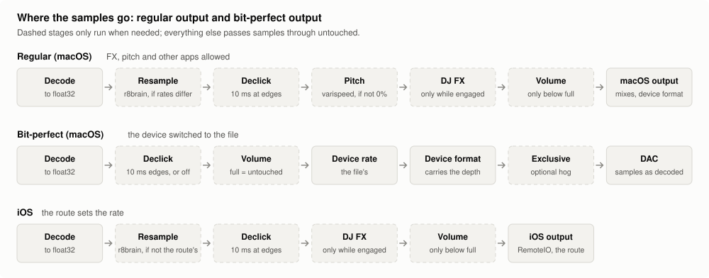
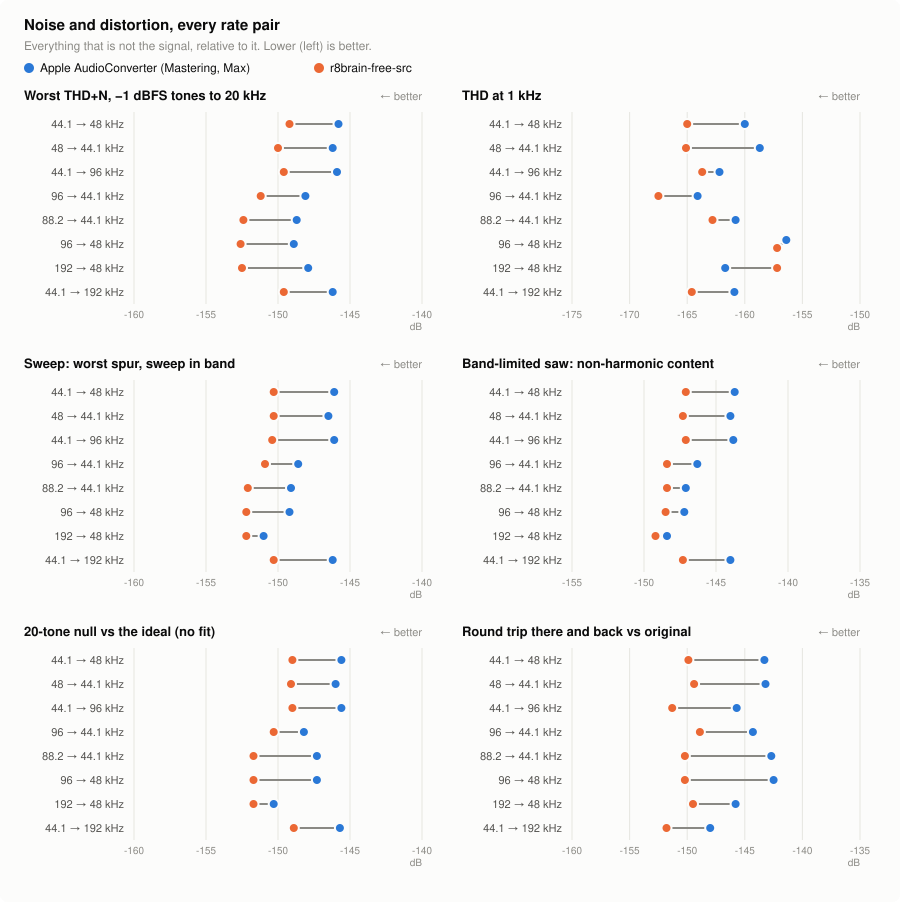
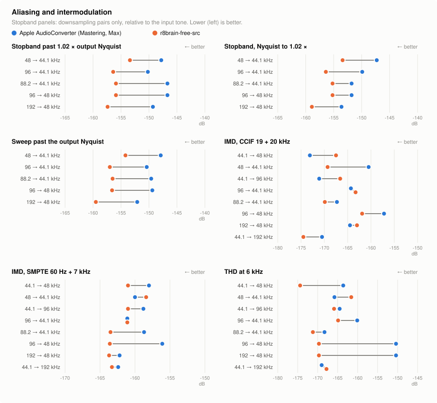
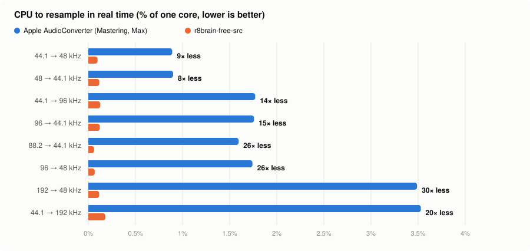
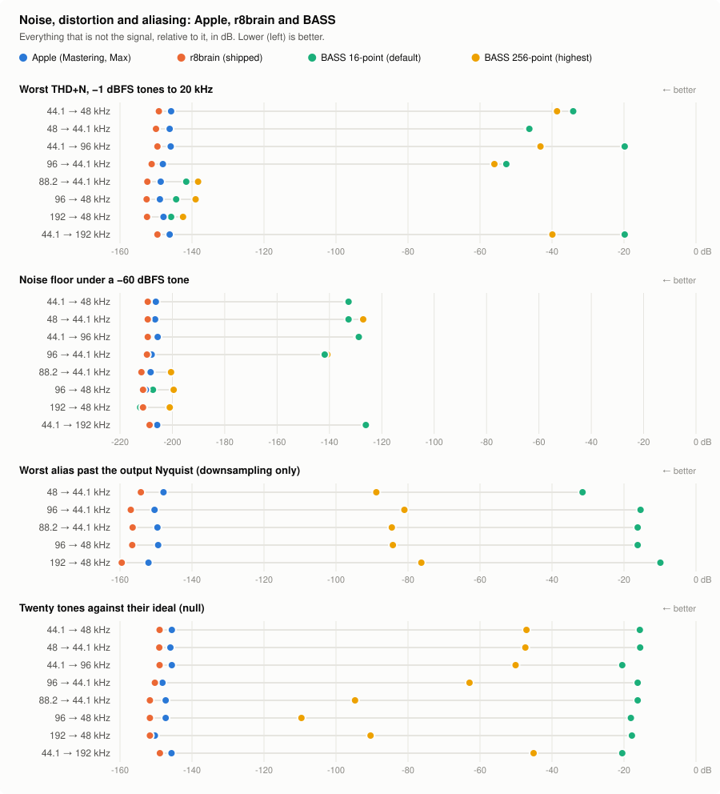
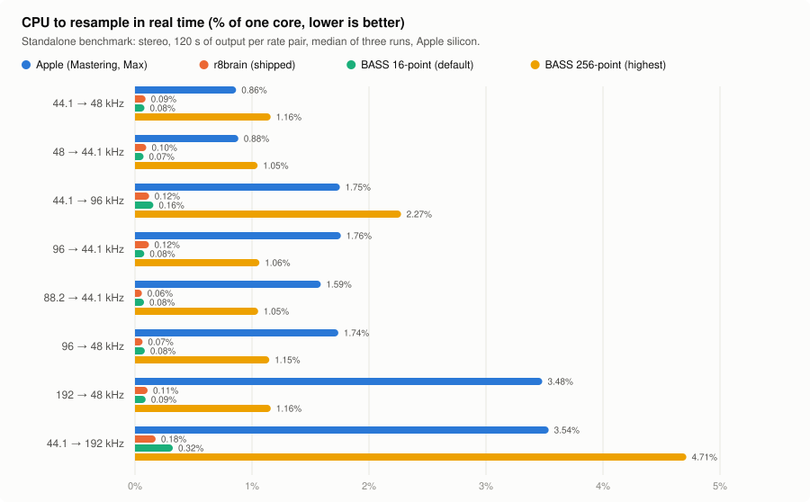

# Audio quality

What Vibe does to the audio between the file and your DAC, what it never does, and how each claim is measured. Every number here comes from a test that runs on every change, or from a measurement described next to it.

## The short version

- **At full volume, 0% pitch and no effect engaged, Vibe hands the output the decoded samples unchanged** whenever the file's sample rate is the output's. The DJ effects and the pitch fader leave the signal path entirely when unused, so "enabled but idle" is exactly the same as "off".
- **When the rates differ, one resampler converts: r8brain-free-src**, a linear-phase, double-precision resampler with a 180 dB stopband. It replaced Apple's converter at every quality measure, at 8–30× less CPU (below).
- **Bit-perfect output (macOS) switches the device to the file** — its sample rate and a format deep enough to carry it — so nothing between the decoder and the DAC changes a sample. Other apps can be kept off the device with exclusive mode.
- **Lossy files are never rounded down to 16 bits for being lossy.** Apple's AAC decoder produces float samples with more than 16 bits of detail, which a 24-bit or float output keeps; its MP3 decoder produces 16-bit samples, which every output format carries exactly.

## Where the samples go

<picture><source media="(prefers-color-scheme: dark)" srcset="audio-quality/signal-path-dark.svg"></picture>

Every file is decoded to 32-bit float. From there, every stage drawn dashed runs only while it has something to do, and passes the samples through untouched — not multiplied by 1.0, not filtered flat, but skipped — otherwise:

- **Resample**: only when the file's rate is not the output's.
- **Declick**: a 10 ms fade at a start, pause, seek or stop, so an edge never clicks. Every other sample is untouched. Settings > Audio > Declick turns it off, and an edge becomes a clean cut. A crossfade between tracks, if you choose one, is the only longer fade.
- **Pitch**: the varispeed runs only while the fader is off 0%. At 0% it is taken out of the path, because even Apple's varispeed at a ratio of exactly 1.0 changes the samples. The fader snaps to exactly 0 at its center.
- **DJ effects**: each effect runs only while engaged, or while its tail still rings, and is then reset and removed. A released low cut sweeps down to 20 Hz, turns into a flat filter so nothing jumps, and a quarter of a second later is removed completely — a high-pass left parked at 20 Hz would still lift the sub-bass through its resonance.
- **Volume**: Vibe's own fader. At full it touches nothing.

The level meters behind the equalizer bars read the output and never write it.

### Regular output

The pipeline runs at the output device's current sample rate. A file at another rate is resampled once, by r8brain; the effects and the pitch fader are available. macOS then mixes Vibe with other apps and converts to the device's format, and its own volume applies after Vibe's.

### Bit-perfect output (macOS)

Settings > Audio > Bit-perfect output, remembered per device; it needs a chosen device rather than System Output. Before a track plays, Vibe switches the device:

- **The sample rate to the file's.** If the device cannot run at it, the smallest whole multiple it offers (a 44.1 kHz file on a 88.2-only device), which r8brain reaches by a whole-number ratio; if neither, the device's own rate, reported as not bit-perfect.
- **The format to one that carries the file's depth**: an integer depth equal to the file's or the next above it (a 16-bit file on a 24-bit format arrives exact, its low bits zero), or float for a float file. A 32-bit integer or 64-bit float file is carried at float32's 24-bit precision, which the status reports.
- **Nothing in between.** The effects and the pitch fader are unavailable; a crossfade is held to the 10 ms declick, and with Declick off no gain is applied at all. Exclusive output (a separate option) takes the device so no other app can mix into it.

The caption under the switch says whether the current track is actually bit-perfect, with the format the device settled on, and if not, the first reason: the rate, a channel conversion, a depth the device cannot carry, the device muted, a volume below full (Vibe's, macOS's, or a balance off center), exclusive access refused, or a lossy source. Only direct outputs qualify — built-in, USB, FireWire, Thunderbolt, PCI, HDMI, DisplayPort, AVB and virtual devices — never Bluetooth or AirPlay, which re-encode, or aggregate devices.

### iOS

iOS owns the output's sample rate, which follows the route (the speaker, wired headphones, a USB DAC). Vibe resamples to it with the same r8brain resampler, and otherwise follows the regular path. There is no bit-perfect mode.

## Lossy files and bit depth

**Some players choose a 16-bit output for MP3 because an MP3 is "a 16-bit file". It isn't: an MP3 or AAC file stores no bit depth at all.** The decoder rebuilds the waveform from frequency coefficients, and a decoder working in float produces samples finer than 16 bits and peaks above full scale. Rounding that to 16 bits adds noise; clipping it to full scale adds distortion.

So under bit-perfect output a lossy file gets the device's float format, else its widest integer format — never 16 bits for being lossy. What that preserves depends on the decoder, and Vibe uses Apple's:

| Apple's decoder | Its only outputs | Samples on the 16-bit grid | Overshoot on a hot master | What a 16-bit output would do |
| --- | --- | --- | --- | --- |
| AAC | float32 or Int16 (Vibe asks for float32) | 0.04% | kept: +0.79 dBFS peak, 1,071 samples over | add noise at −101 dBFS RMS (33 dB under a −68 dBFS fade, against 81 dB at 24 bits) and clip every overshoot |
| MP3, MP2 | Int16 only | 100% | clipped by the decoder: pinned at 0 dBFS | nothing: the decode is already 16-bit |

- **AAC** — the iTunes and Apple Music format, and most lossy files on Apple devices — is where the rule matters. The float output keeps the decode exactly, overshoots included; a 24-bit output keeps it to −149 dBFS.
- **MP3 and MP2** reach Vibe already rounded to 16 bits and clipped at full scale, inside Apple's decoder, which offers no other output. A 16-bit, 24-bit or float output plays identical samples. For comparison, ffmpeg's float MP3 decoder on the same file puts only 0.03% of its samples on the 16-bit grid and peaks at +0.49 dBFS: the precision and headroom a float MP3 decoder would recover. Vibe uses Apple's decoders only.

Measured on a stand-in for a mastered track: harmonic tones and pink noise, TPDF-dithered to 16 bits, peaking at −0.1 dBFS for ten seconds and then fading to −70 dB; a second, hotter master was soft-clipped to full scale. Encoded with LAME at 320 kbps and V2, and with Apple's AAC encoder at 256 kbps; decoded through Apple's decoders as Vibe reads a file, and through ffmpeg. The decoders' output formats are pinned by a test, so an Apple decoder that changed would fail the suite.

## The resampler

Resampling is the one stage that must change samples, so it is held to the most demanding bar. Apple's `AudioConverter` at its highest setting (Mastering complexity, Maximum quality) was the resampler until r8brain-free-src replaced it; both were measured through the same playback engine, on the same signals, at the eight rate pairs a library meets:

- **Stepped sines** at −1 dBFS: passband ripple to 20 kHz, the −0.1 dB and −3 dB band edges, THD and THD+N, the stopband past the output's Nyquist, and phase (timing and linear phase).
- **A −60 dBFS sine**: the noise floor under a quiet signal.
- **A sine sweep to the source's Nyquist**: every spur — alias, image, distortion, noise — frame by frame, in band and past the output's Nyquist.
- **A band-limited sawtooth**: everything that is not one of its harmonics.
- **Twenty tones against their ideal**, computed at the output rate with no fitting, so gain, phase and timing errors all count; and the same there and back (the round trip).
- **CCIF (19 + 20 kHz) and SMPTE (60 Hz + 7 kHz) intermodulation.**
- **An impulse**: magnitude and phase every 10 Hz to 20 kHz.
- **A sine with +3 dBFS peaks between samples**: carried unclipped.
- **Silence, DC, exact duration and CPU.**

**r8brain is equal or better on every quality measure and wins 90 of the 103 per-pair noise, distortion and aliasing comparisons; Apple's eight wins are all between −157 and −173 dB.** It rejects aliases 4–9 dB further and costs 8–30× less CPU.

<picture><source media="(prefers-color-scheme: dark)" srcset="audio-quality/response-dark.svg"></picture>

<picture><source media="(prefers-color-scheme: dark)" srcset="audio-quality/noise-dark.svg"></picture>

<picture><source media="(prefers-color-scheme: dark)" srcset="audio-quality/alias-dark.svg"></picture>

<picture><source media="(prefers-color-scheme: dark)" srcset="audio-quality/cpu-dark.svg"></picture>

Worst THD+N across the passband tones, the twenty-tone null against the ideal, the round trip, and the CPU to keep up in real time (dB; the CPU figures come from the test run, with other tests running beside it):

| pair | Apple THD+N | r8brain THD+N | Apple null | r8brain null | Apple round trip | r8brain round trip | Apple core % | r8brain core % |
| --- | --- | --- | --- | --- | --- | --- | --- | --- |
| 44.1→48 | −145.8 | −149.2 | −145.6 | −149.0 | −143.3 | −149.9 | 0.89 | 0.098 |
| 48→44.1 | −146.2 | −150.0 | −146.0 | −149.1 | −143.2 | −149.4 | 0.90 | 0.116 |
| 44.1→96 | −145.9 | −149.6 | −145.6 | −149.0 | −145.7 | −151.3 | 1.77 | 0.127 |
| 96→44.1 | −148.1 | −151.2 | −148.2 | −150.3 | −144.3 | −148.9 | 1.76 | 0.121 |
| 88.2→44.1 | −148.7 | −152.4 | −147.3 | −151.7 | −142.7 | −150.2 | 1.59 | 0.061 |
| 96→48 | −148.9 | −152.6 | −147.3 | −151.7 | −142.5 | −150.2 | 1.74 | 0.068 |
| 192→48 | −147.9 | −152.5 | −150.3 | −151.7 | −145.8 | −149.5 | 3.49 | 0.115 |
| 44.1→192 | −146.2 | −149.6 | −145.7 | −148.9 | −148.0 | −151.8 | 3.53 | 0.180 |

**On an iPhone 17 Pro**, a 44.1 kHz file to the phone's 48 kHz output, 60 s per resampler, twice: r8brain 0.54% and 0.56% of a core, Apple's 3.39% and 3.27% — about 6× less.

### How r8brain is set up

- **Its 24-bit preset**, about 180 dB of stopband, documented for 24-bit and 32-bit float resampling; the playback engine is float32.
- **A 1% transition band**, half r8brain's default: −0.1 dB at 21.72 kHz and −3 dB at 21.83 kHz from a 44.1 kHz file, level with Apple's filter (21.72 and 21.77 kHz), where the default stopped at 21.39 and 21.61. Every noise, distortion and aliasing figure is unchanged by it; the cost rises about 20%, a few thousandths of a core.
- **Linear phase**, its latency removed inside: zero phase delay and flat group delay at every pair.
- **Double precision throughout**, on its NEON-accelerated FFT; the result is rounded once to float32.

**No dither.** r8brain computes in double and hands float32 to a float32 engine, whose rounding error scales with the signal rather than sitting at a fixed floor dither would decorrelate: a −60 dBFS tone's residual is −209 dBFS, THD at 1 kHz near −160 dB, and there are no truncation harmonics. The one integer rounding is the output's conversion to the device's format, after the resampler. The cases where Apple measured better (all below −157 dB) were rerun with r8brain in double precision and with dither:

| Case | Apple | r8brain in double | r8brain rounded (shipped) | r8brain, TPDF ±1 ULP |
| --- | --- | --- | --- | --- |
| CCIF IMD 44.1→48 | −173.1 | −172.4 | −167.5 | −173.7 |
| CCIF IMD 44.1→96 | −171.1 | −172.4 | −166.6 | −171.8 |
| SMPTE IMD 48→44.1 | −160.0 | −162.6 | −158.4 | −161.8 |
| THD 6 kHz 48→44.1 | −165.8 | −169.7 | −161.6 | −170.0 |
| THD 1 kHz 192→48 | −161.7 | −165.9 | −157.2 | −165.6 |
| *everything else (noise)* | | −153 to −180 | −150 to −157 | −147 to −148 |

In double, r8brain matches or beats Apple everywhere, so the gap is the rounding to float32, not the resampler. Dither would lower those products 3–9 dB but raise the broadband noise 3–9 dB, taking the worst THD+N from −149…−152 dB to Apple's −147…−148 — giving up the measures that count for eight cosmetic ones.

**The CPU**, from a standalone benchmark (120 s of stereo per pair, median of three, % of one core):

| pair | r8brain (shipped) | with r8brain's FFT padding | scalar FFT, with padding | Ooura FFT | the default 2% band, with padding |
| --- | --- | --- | --- | --- | --- |
| 44.1→48 | **0.092** | 0.102 | 0.110 | 0.107 | 0.077 |
| 48→44.1 | **0.098** | 0.105 | 0.116 | 0.114 | 0.080 |
| 96→44.1 | **0.119** | 0.126 | 0.139 | 0.142 | 0.095 |
| 44.1→96 | **0.124** | 0.131 | 0.141 | 0.137 | 0.106 |
| 192→48 | **0.113** | 0.117 | 0.126 | 0.127 | 0.096 |
| 44.1→192 | **0.175** | 0.181 | 0.202 | 0.211 | 0.152 |

A track's first conversion costs at most 0.45 ms; making a resampler, under 0.1 ms.

### BASS, measured and ruled out

**BASS 2.4.18.3 with BASSmix 2.4.13**, un4seen's widely used audio library, was measured the same way at two settings of its resampler: its default (16-point sinc) and its highest (256-point). It removes its own latency, holds DC gain at 1 and produces the exact length, but it passes 63 (16-point) and 67 (256-point) of the suite's 184 checks, where Apple's and r8brain pass all 184.

<picture><source media="(prefers-color-scheme: dark)" srcset="audio-quality/resamplers-quality-dark.svg"></picture>

<picture><source media="(prefers-color-scheme: dark)" srcset="audio-quality/resamplers-cpu-dark.svg"></picture>

BASS columns are 16-point / 256-point, dB unless marked; "past Nyquist" is the worst alias when downsampling:

| pair | −3 dB Hz | worst THD+N | noise dBFS | past Nyquist | twenty-tone null |
| --- | --- | --- | --- | --- | --- |
| 44.1→48 | 17398 / 21565 | −34.1 / −38.6 | −132.7 / −133.0 | — | −15.6 / −47.1 |
| 48→44.1 | 17213 / 21525 | −46.3 / −46.6 | −132.7 / −127.1 | −31.5 / −88.8 | −15.5 / −47.4 |
| 44.1→96 | 18667 / 21565 | −19.8 / −43.2 | −128.8 / −129.2 | — | −20.5 / −50.1 |
| 96→44.1 | 15899 / 20999 | −52.7 / −56.0 | −141.8 / −140.8 | −15.4 / −81.0 | −16.2 / −62.9 |
| 88.2→44.1 | 16107 / 21079 | −141.6 / −138.3 | −208.2 / −200.5 | −16.2 / −84.5 | −16.2 / −94.7 |
| 96→48 | 16810 / 22943 | −144.4 / −139.0 | −207.4 / −199.5 | −16.2 / −84.2 | −18.1 / −109.6 |
| 192→48 | 15436 / 21545 | −145.8 / −142.5 | −212.3 / −201.0 | −9.9 / −76.3 | −17.8 / −90.4 |
| 44.1→192 | 18667 / 21565 | −19.8 / −39.9 | −126.1 / −126.2 | — | −20.5 / −45.1 |

- **The passband.** At 16 points the response droops from low frequencies to −3 dB at 15.4–18.7 kHz; at 256 points it holds 0.1 dB to 20.0–22.1 kHz, against 21.72 kHz for Apple and r8brain.
- **Its filter's transition straddles the Nyquist**, so content near it images and aliases: a 20 kHz tone's image at 24.1 kHz is why the worst THD+N sits at −20 to −56 dB wherever the ratio is not a whole number. Downsampling, the worst alias is −10 to −32 dB at 16 points and −76 to −89 dB at 256, against −148 to −160 dB for the other two.
- **A −126 to −142 dBFS noise floor at every uneven ratio, at both settings**, where the others reach −206 to −212. At the exact 2:1 and 4:1 ratios BASS reaches −200 to −212, so the floor comes from how it interpolates its filter, not from float precision.
- **What it would sound like.** At 256 points, almost nothing: THD at 1 kHz is −113 to −153 dB, and the aliases and the noise floor are below hearing; the worst THD+N figures come from one image of a 20 kHz tone. At the default 16 points the treble is audibly down, 3 dB by 15–19 kHz. BASS is ruled out by the comparison, not by audibility: r8brain passes every bound at about the CPU of BASS's lowest setting.
- **The cost is the filter's length.** BASS on its own reads the same as through Vibe's engine, doubling with each setting — a direct convolution, where Apple and r8brain reach their long filters with multi-stage and FFT designs:

  | pair | 16-pt | 32-pt | 64-pt | 128-pt | 256-pt |
  | --- | --- | --- | --- | --- | --- |
  | 44.1→48 | 0.078 | 0.155 | 0.310 | 0.603 | 1.215 |
  | 48→44.1 | 0.072 | 0.145 | 0.276 | 0.551 | 1.100 |
  | 44.1→96 | 0.152 | 0.301 | 0.610 | 1.212 | 2.432 |
  | 96→44.1 | 0.074 | 0.142 | 0.280 | 0.558 | 1.105 |
  | 192→48 | 0.079 | 0.155 | 0.306 | 0.610 | 1.204 |
  | 44.1→192 | 0.309 | 0.628 | 1.256 | 2.420 | 4.855 |

- **And it is closed source**, free only for non-commercial use.

## How it is tested

Every change runs these in continuous integration, with no audio hardware involved:

- **The playback engine, sample for sample.** The real player renders into memory and every frame of every channel is compared with the file: 44.1 to 192 kHz, 16-bit, 24-bit and float, mono and stereo, lossless and lossy containers. Bit-perfect and regular playback must match exactly — only a declick's first 50 ms is excused, and nothing with Declick off. The comparison catches a single changed bit, a dropped or repeated frame, a swapped channel and a polarity flip.
- **Transparency when idle.** With the effects enabled but idle, with the level meter running, at 0% pitch, and after every effect has been engaged and released — each key, the boost, the iOS pad, an effect switched off halfway through its sweep — the file must play back exactly: not within a tolerance, exactly. A low cut left parked as a flat filter differs by about 7 × 10⁻¹³, and only an exact comparison sees that.
- **The resampler**, against every bound above, at eight rate pairs; across a gapless track change at every rate pair and buffer size, which must continue the unsplit file frame for frame; and against the same conversion made independently of the engine, which must match exactly.
- **Lossy decoding**: each lossy format against its own decode, exact except AAC, whose independent decodes differ by four float rounding steps (below −126 dBFS); and the decoders' output formats, as above.

On macOS, an opt-in loopback run plays through a real output device and captures it again, to prove the samples reach the hardware as rendered.
