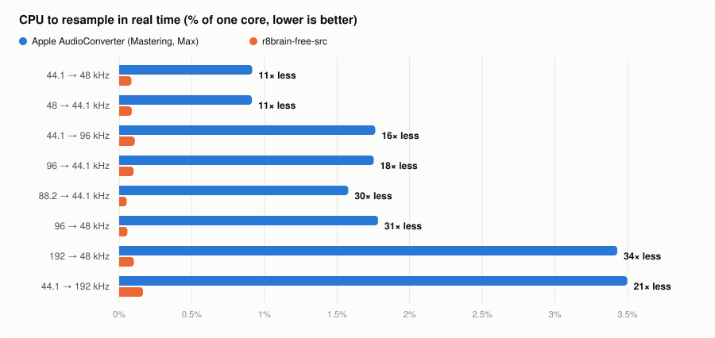
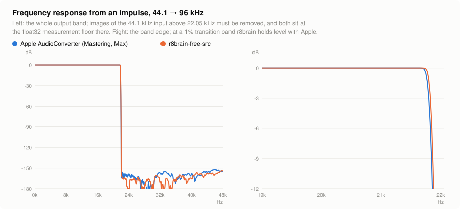
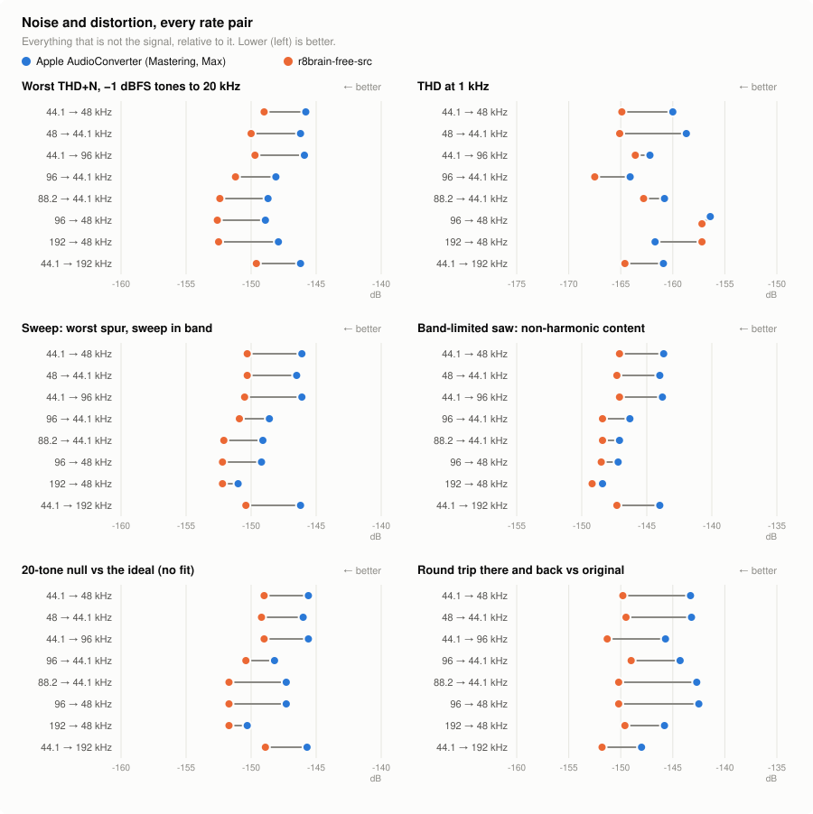
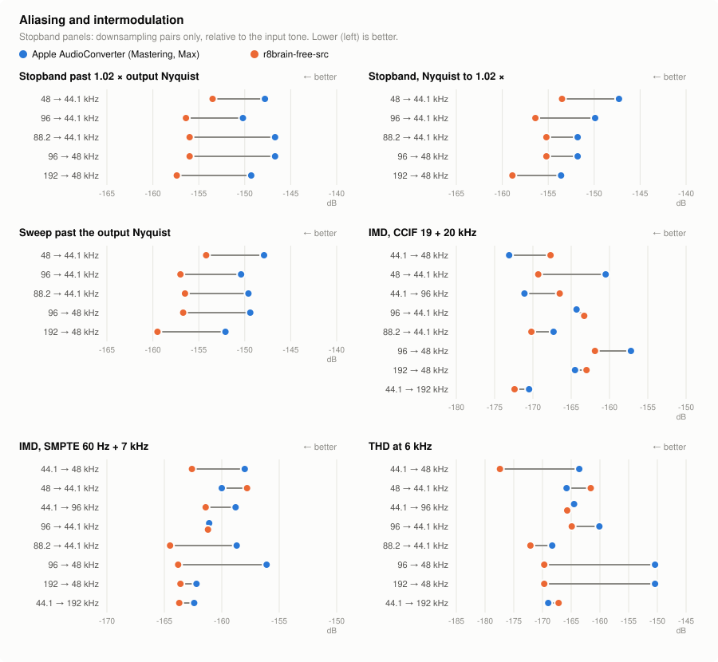

# Future: the resampler's cost

**Status: under evaluation on `claude/r8brain-resampler` (2026-09-28).** r8brain-free-src is vendored and wired into the voice bus beside Apple's converter, selectable per player and switched live by a debug verb; **r8brain is the default on both platforms while it is tested**, Apple's converter one `set_resampler apple` away. Adopting r8brain would reverse the root `AGENTS.md`'s "Apple frameworks only" rule for playback, so the decision needs a reason stronger than CPU on a Mac. The measurements below say it costs nothing in quality and saves a great deal of CPU; what is left is the decision and an iOS device measurement.

## What Apple's converter costs

- **macOS** converts at `kAudioConverterQuality_Max`, always (`Audio/AGENTS.md`). A Time Profiler pass on an optimized build (silent real HAL, 44.1 kHz FLAC and MP3 into the built-in speakers at 48 kHz) put steady playback at 3.4% of one core, about 70% of it in Apple's `Resampler2::ConvertSIMD_SmallIntegerRatio`; FLAC decode was about 5%, the per-tick position UI about 3%. A file at the device's rate converts nothing.
- **iOS** lowered its default to `kAudioConverterQuality_High` for cost (#74): 1.8% of a core against 3.3% at Max on device, flat to 21 kHz with the same alias rejection.

## What is built

- **`Vibe/ThirdParty/r8brain/`**: r8brain-free-src at upstream `9e73d2dd`, with its PFFFT double-precision FFT (`Vibe/ThirdParty/AGENTS.md` has the build flags and why).
- **`Audio/AudioResampler.{h,mm}`**: r8brain behind `AudioConverterFillComplexBuffer`'s shape, so the bus's one input proc (`VibeConverterSupplyInput`) drives either resampler, and the stream-end, hold-open and flush logic is shared unchanged (`VibeRecordConverts`). One `CDSPResampler24` per channel, pulled until a fill is met.
- **`AudioPlayer.resampler`** (`VibeResamplerR8brain` default, `VibeResamplerApple`), pushed to the bus like `resamplingQuality`, applying from the next conversion; `dump_audio_path`'s conversion stage reports `resampler`.
- **Debug verbs** (both platforms, `DebugCommonVerbs.m`): `set_resampler <apple|r8brain>` switches and re-voices the current track at its position (a seek), so the change is heard at once; `dump_resampler_costs [reset]` reports each resampler's decode-thread CPU (the fill less the file reads inside it), the bus audio it produced and `corePercent`, the real-time cost, since the bus was made or the last reset. A rebuilt bus starts from zero.
- **`Tests/ResamplerQualityTests.m`** (`make test`): both resamplers through the production bus at 44.1→48, 48→44.1, 44.1→96, 96→44.1, 88.2→44.1, 96→48, 192→48 and 44.1→192, each held to the same bounds and the measured table attached to the result bundle as "resampler quality". It covers stepped sines (ripple, −0.1/−3 dB edges, THD, THD+N, stopband, phase delay and linear phase), a −60 dBFS noise floor, a continuous sweep to the source's Nyquist (every spur, in band and past the output's Nyquist), a band-limited sawtooth (everything that is not a harmonic), a twenty-tone null against the ideal with no fit, the round trip there and back, CCIF and SMPTE intermodulation, the impulse response's magnitude and phase every 10 Hz, a sine with +3 dBFS inter-sample peaks, silence, DC, exact duration and CPU. `testR8brainContinuesAcrossAGaplessBoundary` shows a split file queued as a successor equals the unsplit one. The metric list follows the measures practitioners name for SRC quality (dsp.stackexchange #92001; KVR "resampler quality" thread 614986), less memory footprint.

## Settings chosen, and why

From r8brain's README and class documentation:

- **`CDSPResampler24`** (`r8brr24`, about 180 dB stopband): documented for "24-bit resampling (including 32-bit floating point resampling)", and the bus is float32. The 206.91 dB default is for double-precision output nothing here keeps.
- **Transition band 1%**, half upstream's default (2%, the tight end of its "2 to 3 … most cases" range): −0.1 dB at 21.72 kHz and −3 dB at 21.83 kHz from a 44.1 kHz source, level with Apple's Mastering/Max filter (21.72 and 21.77 kHz) where 2% stopped at 21.39 and 21.61. Measured both ways through the whole quality suite: every noise, distortion and aliasing measure is unchanged (the mean shift per measure is under 0.4 dB either way, run-to-run noise at −150 dB), and the cost rises about 20%, a few thousandths of a percent of a core. The longer filter's startup is compensated inside, like the rest of its latency.
- **Linear phase**: the tests read zero phase delay and flat group delay at every pair, the latency removed inside.
- **`aMaxInLen` 4096**, the most the bus's proc supplies in one call.
- **`R8B_PFFFT_DOUBLE`** (Ooura's precision; the single-precision `R8B_PFFFT` is "not recommended" for professional audio) with **`PFFFT_ENABLE_NEON`**. PFFFT's NEON path is opt-in: without the macro arm64 silently builds its scalar fallback, which the vendored files' suppressed warnings hide (x86_64 picks SSE2 on its own). Intel IPP does not apply on Apple silicon.
- **`R8B_EXTFFT` off.** At 2% it paid (3–5% cheaper), but the 1% filter already runs large FFT blocks, and its extra zero-padding then costs 3–10% more at every pair (the table below). Measure it again if the transition band changes.
- **`-O3` in every configuration** for the two vendored translation units, since Debug is where the comparison runs and Apple's converter is always optimized.

**Performance audit.** Every SIMD path is live: r8brain's own NEON (`R8B_NEON`, from `__aarch64__`; SSE2 on x86_64) in the interpolator and half-band filters, and PFFFT's NEON FFT and block convolution once `PFFFT_ENABLE_NEON` is set (`clang -H` also confirms the vendored set is exactly what compiles). Upstream deliberately leaves its shuffled interpolation off on Apple silicon ("inefficient on M1"). A standalone benchmark of the production shim, 120 s per pair, median of three, % of one core, at the shipped 1% transition band (the last column is the 2% configuration it replaced):

| pair | **PFFFT NEON (shipped)** | NEON + EXTFFT | PFFFT scalar + EXTFFT | Ooura + EXTFFT | Ooura (stock) | at 2%: NEON + EXTFFT |
| --- | --- | --- | --- | --- | --- | --- |
| 44.1→48 | **0.092** | 0.102 | 0.110 | 0.098 | 0.107 | 0.077 |
| 48→44.1 | **0.098** | 0.105 | 0.116 | 0.101 | 0.114 | 0.080 |
| 96→44.1 | **0.119** | 0.126 | 0.139 | 0.126 | 0.142 | 0.095 |
| 44.1→96 | **0.124** | 0.131 | 0.141 | 0.127 | 0.137 | 0.106 |
| 192→48 | **0.113** | 0.117 | 0.126 | 0.117 | 0.127 | 0.096 |
| 44.1→192 | **0.175** | 0.181 | 0.202 | 0.191 | 0.211 | 0.152 |

A voice's first fill costs at most 0.45 ms, and making a resampler is under 0.1 ms, its filters cached across voices. Not taken: `-ffast-math`, which reorders float math in a path measured to −150 dB; and AVX for Intel Macs, which would need app-wide per-architecture flags where SSE2 already runs.

**No dither.** r8brain computes in double and hands float32 to a float32 bus, whose rounding error scales with the signal rather than sitting at a fixed floor dither would decorrelate: the −60 dBFS tone's residual is −209 dBFS with both resamplers, THD at 1 kHz near −160 dB, no truncation harmonics. The one integer requantization is the output's float → device conversion (`Audio/Mac/Devices/AGENTS.md`), downstream of the resampler and shared with Apple's path; dithering there is a separate question that matters only for a 16-bit device, and it could never apply under bit-perfect output. The README's PRVHASH suggestion is for requantizing to integers, which the resampler never does.

## Measured (Apple Silicon Mac, unit test, Debug build with the resamplers optimized)

The charts are drawn from one `make test` run of `ResamplerQualityTests` and, for the frequency response, an impulse through each resampler at the bus's settings; `resampler/*.svg` are their light and dark versions.

<picture><source media="(prefers-color-scheme: dark)" srcset="resampler/cpu-dark.svg"></picture>

<picture><source media="(prefers-color-scheme: dark)" srcset="resampler/response-dark.svg"></picture>

<picture><source media="(prefers-color-scheme: dark)" srcset="resampler/noise-dark.svg"></picture>

<picture><source media="(prefers-color-scheme: dark)" srcset="resampler/alias-dark.svg"></picture>

Worst THD+N across the passband tones, the multitone null against the ideal, the round trip, and the CPU to keep up in real time:

| pair | Apple THD+N | r8brain THD+N | Apple null | r8brain null | Apple round trip | r8brain round trip | Apple core % | r8brain core % |
| --- | --- | --- | --- | --- | --- | --- | --- | --- |
| 44.1→48 | −145.8 | −149.2 | −145.6 | −149.0 | −143.3 | −149.9 | 0.89 | 0.098 |
| 48→44.1 | −146.2 | −150.0 | −146.0 | −149.1 | −143.2 | −149.4 | 0.90 | 0.116 |
| 44.1→96 | −145.9 | −149.6 | −145.6 | −149.0 | −145.7 | −151.3 | 1.77 | 0.127 |
| 96→44.1 | −148.1 | −151.2 | −148.2 | −150.3 | −144.3 | −148.9 | 1.76 | 0.121 |
| 88.2→44.1 | −148.7 | −152.4 | −147.3 | −151.7 | −142.7 | −150.2 | 1.59 | 0.061 |
| 96→48 | −148.9 | −152.6 | −147.3 | −151.7 | −142.5 | −150.2 | 1.74 | 0.068 |
| 192→48 | −147.9 | −152.5 | −150.3 | −151.7 | −145.8 | −149.5 | 3.49 | 0.115 |
| 44.1→192 | −146.2 | −149.6 | −145.7 | −148.9 | −148.0 | −151.8 | 3.53 | 0.180 |

r8brain is equal or better on every quality measure, band edge included, and wins 90 of the 103 per-pair noise, distortion and aliasing comparisons (Apple 8, ties 5); Apple's eight are all between −157 and −173 dB. It rejects aliases 4–9 dB further and costs 8–30× less CPU (these unit-test figures run with the suite's classes in parallel; the benchmark above is the quieter measure); power-of-two ratios take its half-band path and are cheapest. In the running Debug app (`--no-audio-hw`, 96 kHz FLAC to the pump's 44.1 kHz), `dump_resampler_costs` read Apple at 4.1–4.7% of a core and r8brain at 0.56% (measured at 2%). Both pass every bound in the test; the full table is the result bundle's attachment.

## What is left

- **iOS on device**: the same verbs on a phone, against Apple at High (iOS's default) and Max, and an Instruments pass for battery-relevant cost. The unit test covers macOS only.
- **The decision**: keep r8brain the default (and whether iOS's Resampling setting, which only Apple's converter reads, then goes away), return it to opt-in, or remove it. Adopting it means rewording the root `AGENTS.md`'s playback rule. The SRC tail `TRAP:` describes Apple's flush bug, which r8brain does not have — but r8brain has no end-of-stream call at all, and feeding zeros until the input's length × ratio is out is upstream's own way to take its tail (`example.cpp`), so the bus's silence flush is already its native path and there is no Apple-only work to strip from it. If Apple's converter were removed, only the `TRAP:`'s wording would change.
- **Listening**: `set_resampler` switches live for an A/B at any rate the device refuses.
