# Performance

<!-- performance:begin -->

### The app

The app benchmarks: each release's own app, launched and driven the same way, on one machine (Apple M2 Pro, 32 GB, macOS 26.5.2); lower is better everywhere. A version marked pre-release was measured before its release was tagged. What each number measures and how to run it is below the charts.

| | 1.8 | 1.9 | 1.10 | 1.11 | 1.12 | 1.13 | 1.14 |
| --- | ---: | ---: | ---: | ---: | ---: | ---: | ---: |
| App startup, window shown (ms) | 181 | 180 | 181 | 185 | 189 | 192 | 208 |
| Time to play, first file after launch (ms) | 65 | 68 | 69 | 68 | 68 | 74 | 44 |
| Time to play, track switch, mean of 6 formats (ms) | 35 | 35 | 36 | 35 | 36 | 36 | 3 |
| Seek latency, 3 min files, mean of 3 formats (ms) | 53 | 53 | 53 | 53 | 75 | 74 | 4 |
| Seek latency, 60 min VBR MP3 (ms) | 53 | 54 | 54 | 54 | 75 | 74 | 5 |
| Seek latency, VBR MP3 without Xing (ms) | 53 | 53 | 53 | 54 | 75 | 73 | 2 |
| Playback CPU, MP3 320k (% core) | 4.7 | 4.5 | 4.6 | 4.6 | 3.8 | 3.8 | 1.8 |
| Playback CPU, FLAC 24/192 (% core) | 7.3 | 7.6 | 7.9 | 7.7 | 5.1 | 5.2 | 2.7 |
| Playback CPU, FLAC 24/192 + FX (% core) | 10.7 | 11.2 | 11.3 | 11.4 | 8.6 | 8.5 | 6.8 |
| Playback CPU, FLAC 24/352.8 (% core) | 11.0 | 11.5 | 11.6 | 11.6 | 6.6 | 6.6 | 4.1 |
| Playback CPU, FLAC 24/192 at +8% pitch (% core) | 10.0 | 10.8 | 10.8 | 10.9 | 10.4 | 10.4 | 6.7 |
| Waveform analysis, FLAC 16/44.1, 3 min (ms) | 194 | 191 | 192 | 192 | 192 | 192 | 204 |
| Waveform analysis, MP3 320k, 60 min (s) | 4.8 | 4.8 | 4.8 | 4.8 | 4.8 | 4.8 | 2.2 |
| Library metadata scan, cold (s) | 0.28 | 0.31 | 0.48 | 0.49 | 0.43 | 0.45 | 0.41 |
| Memory, idle (MB) | 29 | 29 | 29 | 30 | 29 | 31 | 40 |
| Memory, peak (MB) | 103 | 105 | 62 | 64 | 58 | 60 | 66 |

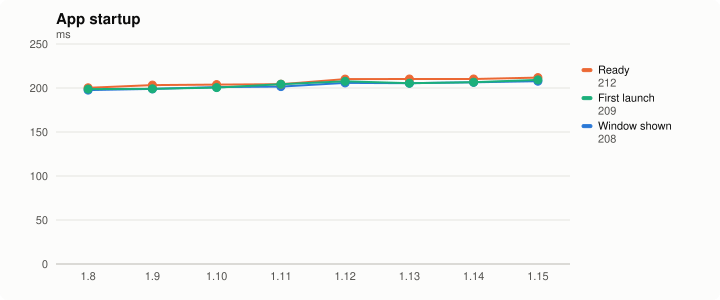
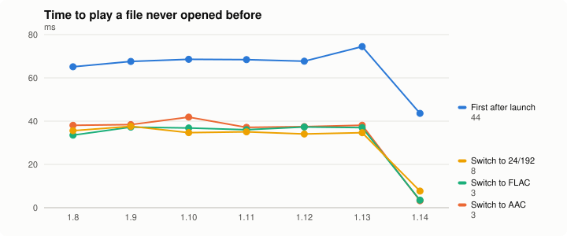
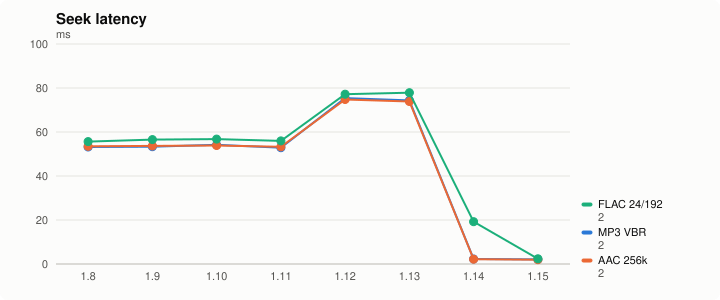
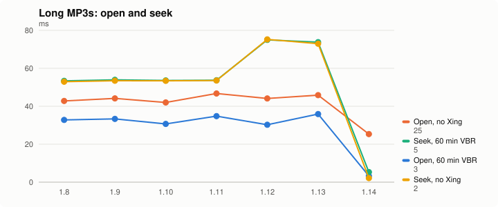
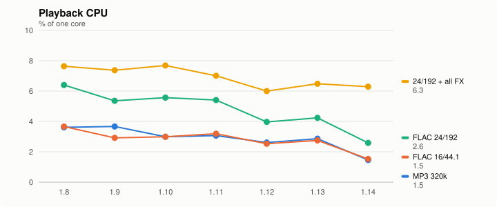
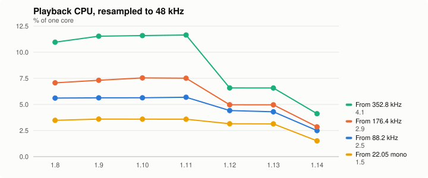
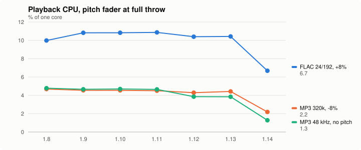
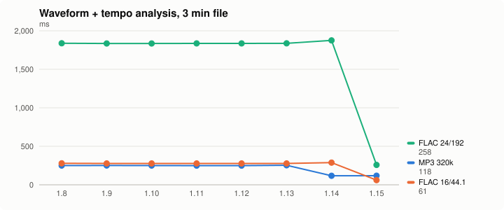
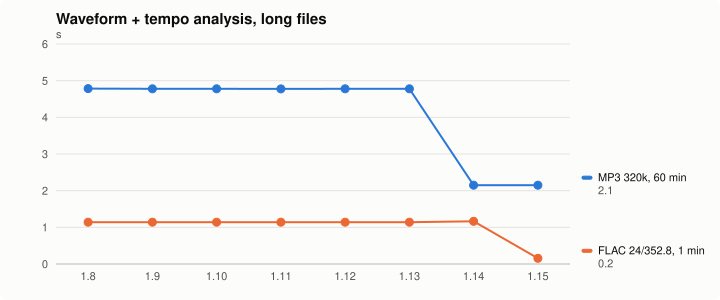
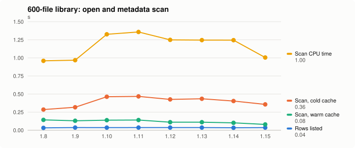
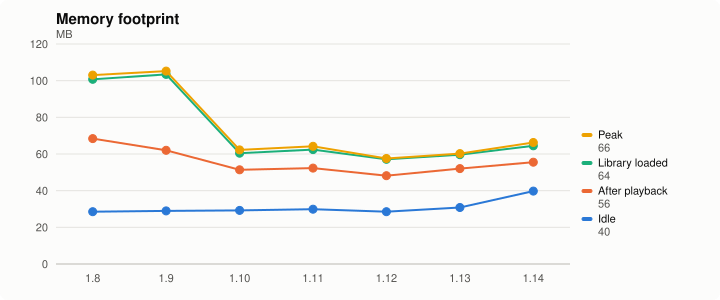
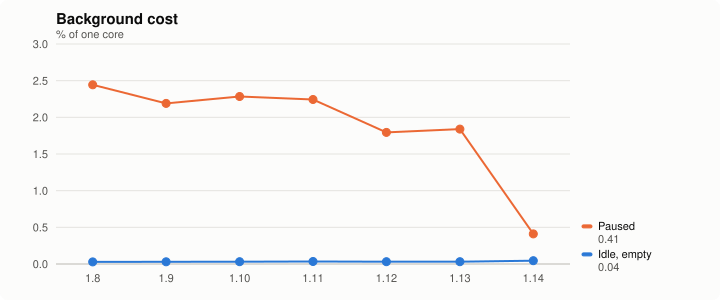
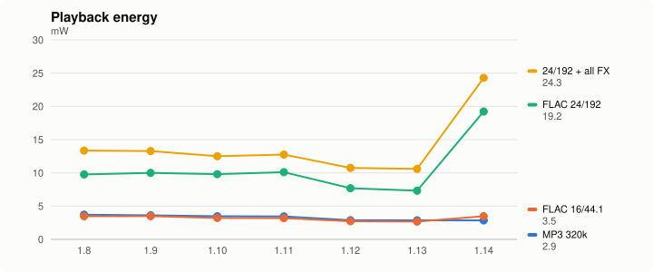
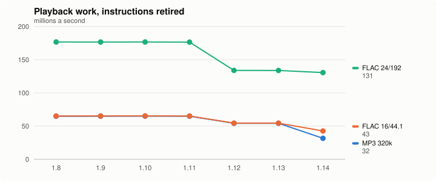
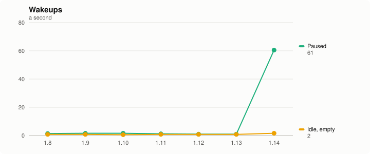

### Components

The component benchmarks, VibeBenchComponents, built against each version's own code and run on one machine (Apple M4 Max, 64 GB, macOS 27.0): the code under each feature, without the app around it. A line that starts late is a benchmark of code that version does not have; a version marked pre-release was measured before its release was tagged.

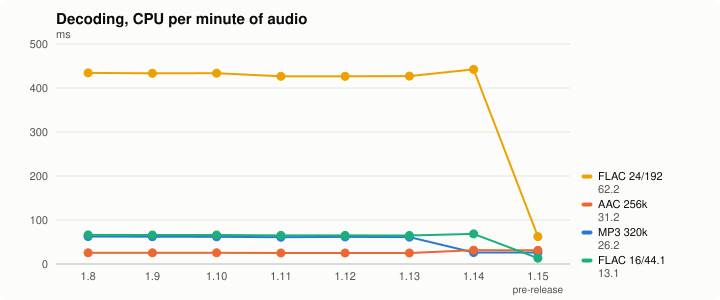
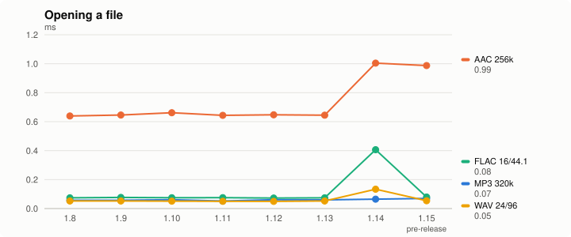
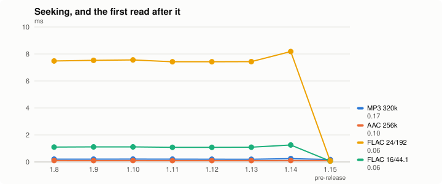
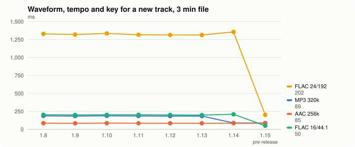
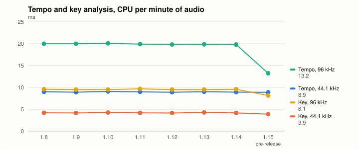
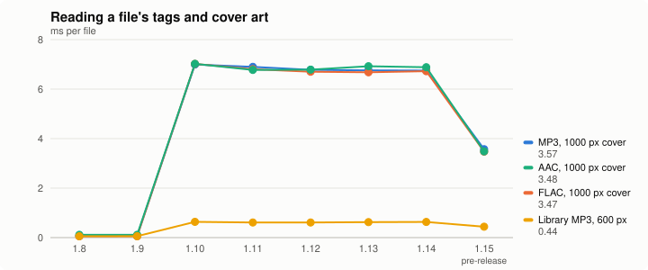
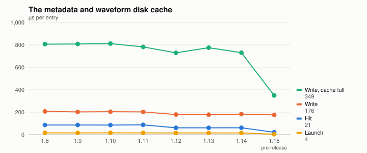
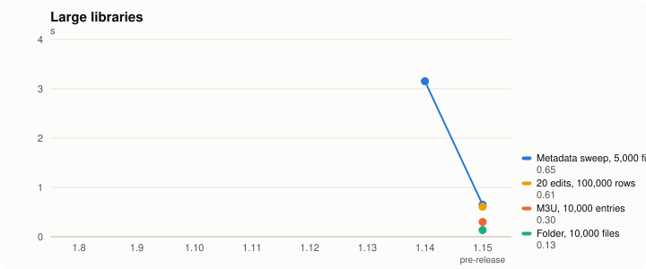

<!-- performance:end -->

## How it works

The numbers above come from two benchmark suites, each run unchanged against every release. Their job is to show a regression or an improvement between versions, so everything about them is held fixed except the app's own code. The **app benchmarks** (`scripts/bench/`, this section) launch each version's own app and drive it; the **component benchmarks** (the `vibe-perf` skill, [below](#the-component-benchmarks)) run each version's production code in-process, without the app.

```bash
make bench-releases VERSIONS="1.16"         # a new release: both suites at tag v1.16, this page redrawn
make bench-releases VERSIONS="HEAD"         # this checkout before its release, charted as "<its version> pre-release"
make bench-releases VERSIONS="1.16=<ref>"   # any other commit, under that version
make bench-releases                         # every version on this page again, e.g. on a new machine
make bench-app VERSIONS="1.16"              # the app benchmarks alone
make bench-components-releases              # the component benchmarks alone (no app launches)
make bench-report                           # this page's charts and table from results.json alone
```

A version is a release tag (`1.16` means `v1.16`), a version at a commit (`1.16=<ref>`), or a bare ref such as `HEAD`, which is labelled with the version its own `project.yml` declares. **A version whose `v<version>` tag does not exist yet is a pre-release**: it is stored and charted, labelled `1.16 pre-release`, until a run at the tag replaces it.

A version takes about half an hour on an M4 Max, longer on a slower Mac (five repetitions of every scenario; `ARGS="--reps 1"` for a quick look). The suite launches the app fifteen times per repetition and each launch takes focus, so leave the Mac alone while it runs, and put Bluetooth headphones away: the app is held to the built-in speakers, but a headset that is the system default can still be pulled in by the OS. It needs `ffmpeg` (`brew install ffmpeg`) for the corpus, generated once into `build/bench/corpus`.

### What is held fixed

- **The build.** `build-version.sh` checks the tag out into its own worktree and builds it with the same settings whatever that version's `project.yml` says: Release optimization (`-Os`, `NDEBUG`, no `NSAssert`) with `DEBUG=1` added back so the debug command channel is compiled in, `VIBE_VERBOSE_LOGGING=0` (betas carry instrumentation a release does not), no App Sandbox, its own bundle ID, `com.commonwealthrecordings.Vibe.bench`, and its own process name, `VibeBenchApp`: other sessions' tooling runs `pkill -x Vibe`, which would kill a measurement mid-run.
- **The state.** Every scenario starts from an empty home (`CFFIXED_USER_HOME`), so caches are cold unless the scenario says warm. That moves caches but not preferences, which `cfprefsd` keeps in the real home whatever the home variable says; so the bench builds carry their own bundle ID, and the runner resets that preferences domain before every scenario and seeds it. Nothing touches the installed app's container.
- **The audio device.** The real output path on the built-in speakers, silent: every launch passes `--silent`, so the output unit drives the device and its clock while the samples are zeroed after the meter. Every version's saved output device is seeded as the speakers (`AudioPlayer.deviceUID`, the same key in all of them) with bit-perfect and exclusive output off in the builds that have them (1.12 on), and the runner refuses to open a file until `dump_state` shows the app bound to the speakers with bit-perfect off. Every launch also passes `-NSAppSleepDisabled YES`.

  The speakers run at 48 kHz, so every file not at 48 kHz is resampled, 44.1 kHz included.

  Not `--no-audio-hw`. Its debug pump stands in for the device with a 20 ms timer, and in 1.8, where it drives AVAudioEngine's offline manual rendering, a track switch or seek under load could take tens of seconds that no real device ever showed. Measure the real path.
- **The corpus.** Generated deterministically by `bench.py` with ffmpeg into `build/bench/corpus` (1.4 GB): decorrelated pink noise under a 120 BPM kick — broadband, so lossless files barely compress and decoding is at its worst — each file tagged with a 1000 px cover. Fifteen playback files: the everyday formats at 3 minutes (MP3 320k and V0, AAC 256k, FLAC 16/44.1, 24/96 and 24/192, WAV 24/96); MP3 at its worst (an hour at 320k and at V0, ten minutes of VBR with no Xing header, so no seek table and no frame count, and 48 kHz, the one MP3 not resampled); and the resampler at awkward ratios (FLAC 24/88.2, 24/176.4, 24/352.8 DXD, and 16/22.05 mono, upsampled). Plus a 600-file library: 30 albums × 20 tracks of MP3, FLAC and AAC, every file tagged with a 600 px cover. `results.json` records a hash of it.
- **The load.** Before every scenario the runner waits until the whole machine has been at least 80% idle for three seconds running (`top`; `ARGS="--idle <percent>"`), and records that idle level in `results.json`. Another workload would inflate every number, unevenly across cores, and chart as a regression.
- **The machine.** Results are only comparable from one machine. `results.json` records the chip, memory, macOS and Xcode per version, and the report charts only versions measured on the newest entry's machine and corpus. After a change of either, `make bench-releases` with no `VERSIONS`.

**Which build each version is.** A release's tag: `v1.8` through `v1.12`. 1.13 never had a final tag, so it is its last build, `1.13-beta11` (`6992feca`); 1.14 is `1.14-beta3` (`8ae57716`), until a run at `v1.14` replaces it. A pre-release is the commit it was measured at. `results.json` records the ref, the commit and `prerelease` for every entry.

**Patches.** 1.8 and 1.9 predate `dump_metadata_progress`, the channel verb the library scan settles on; `scripts/bench/patches/<version>.patch` backports it (it reads state and changes nothing). No other version is patched.

### How each number is taken

Every metric is the median of five repetitions, each in a fresh app launch; the noisiest ones are themselves medians or means over many samples within a repetition (below). Lower is better throughout.

The suite drives the app through the debug command channel with its own client, which speaks the channel's wire format; a command round trip is about half a millisecond. Nothing is timed from the send: the app deletes a command's file as it starts on it, and that moment starts every interval. The position is the device's rendered audio, so a `dump_state` handled at time T showing position P says rendering began at T − P: time to play and seek latency are back-dated that way, and are exact to the output's IO cycle whatever the polling cadence.

So the suite polls gently, every 25 ms. `dump_state` runs on the app's main thread, and a tight loop is thousands of requests a second: it pins the main thread and measures the benchmark instead of the app, worst in 1.8, whose `dump_state` is heaviest.

One source change the build makes to every version, for the channel alone: in `Vibe/Debug/`, `NSTemporaryDirectory()` reads `VIBE_DEBUG_TMPDIR` first. An unsandboxed app's temp dir is the shared per-user one, and the channel lists its thousands of entries on every command, about 20 ms each, which would swamp every interval.

CPU, memory, wakeups and energy are read from outside with `proc_pid_rusage`, the same in every version: CPU time over a window as a percentage of one core, `phys_footprint` for memory.

| Metric | Scenario |
| --- | --- |
| **App startup** | Process spawn to the first on-screen window (`scripts/bench/probe.swift`, from the window server, no permission needed), and to the first channel reply. *Warm* is the median of ten relaunches over the same home; *first launch* the median of three, each into an empty home with reset preferences. |
| **Idle cost** | CPU %, wakeups/s and footprint over 5 s, 4 s after a first launch with nothing loaded. *Paused* is the same after the playback scenario pauses a loaded track. |
| **Time to play** | `open` of a file never opened before (cold metadata, art and waveform) to the first rendered audio. The first, MP3 320k CBR, is the first play after launch, so it includes starting the output; the other six are track switches from a playing file: MP3 V0 VBR, AAC 256k, FLAC 16/44.1, FLAC 24/96, FLAC 24/192, WAV 24/96. A version that keeps its output running across a switch (1.14 on) plays the next file in a few milliseconds. The long and resampler-stress files below are opened the same way, and their times are recorded too. |
| **Playback CPU** | 8 s of steady playback of every one of the fifteen files, measured once the open's background analysis has gone quiet, so it is the render path plus the UI. The same window gives *playback energy* (the process's energy over it, as `proc_pid_rusage` reports it), *playback work* (instructions retired a second, steadier than CPU time) and *wakeups* while playing (recorded from 1.15's suite on, so earlier runs have none until a rerun). The FX worst case is FLAC 24/192 with reverb, delay, short delay and low kill all on; the pitch-fader cases hold the varispeed at full throw, +8% on FLAC 24/192 and −8% on MP3 320k, a non-integer ratio on top of the rate conversion. |
| **Seek latency** | 40 seeded seeks per file, each from the app taking the command to audio rendering past the target, the mean per repetition: MP3 V0, AAC and FLAC 24/192 at 3 minutes, and the hour-long MP3s and the MP3 without a Xing header, where a seek deep into the file is the worst case. |
| **Waveform analysis** | `file_cache` on a cleared entry: the full decode, waveform and tempo analysis, until the entry is on disk. MP3 320k, FLAC 16/44.1 and FLAC 24/192 at 3 minutes; an hour of MP3; a minute of DXD. |
| **Library** | `open` of the 600-file folder into an empty cache: until every row is listed, and until every row's metadata has been read (`dump_metadata_progress`). *Warm* repeats the scan in a relaunch over the filled cache. The CPU seconds it cost and the footprint afterwards and at peak are recorded too. |

`results.json` keeps every repetition's raw value under `samples` beside the median.

### The component benchmarks

The second set of charts is the code under each feature, without the app around it: `Tests/BenchComponents/`'s VibeBenchComponents (the `vibe-perf` skill, whose `SKILL.md` explains running it) drives the production code in-process — the player's file reader opening, decoding and seeking, the waveform pass with tempo and key, the analyzers alone, the metadata parse with its cover art, the disk cache, and the large-library operations — and `make bench-components-releases` (or `make bench-releases`, after the app benchmarks) runs it against every version into `results.json`'s `components` section. No app launches, so the Mac can be in use.

One harness, today's, is built against every version's own code. `perf.py releases` checks the version out, writes `VibeBenchComponentsFeatures.h` from what its sources have (the reader was `AVAudioFile` until 1.14 and `AudioFileHandle` from it; the waveform loader was `AVFAudioWaveformLoader`; the analyzers were switched by two settings before 1.10 had a provider; the meter summarized apart from consuming from 1.14), derives a `VibeBenchComponents` tool target from that version's own app target (`xcodegen dump`), so 1.8's flat source layout builds as it was, and leaves out any benchmark file that version cannot compile. So a line that starts late is code the version does not have: the level meter from 1.10, the metadata sweep from 1.14, the playlist-file, folder-walk and playlist-edit benchmarks from 1.15.

Each number is the median of five runs of one process per version, after a warm-up. Decoding and analysis are CPU time per minute of the file's audio, opening and seeking CPU time per operation, the waveform pass wall time (it pipelines across two threads), the metadata parse, the disk cache and the libraries wall time per file, entry or job. The machine is recorded separately from the app benchmarks', and these charts compare only versions measured on one machine. CPU time stays within a few percent under load, unlike wall time; instructions retired, which hardly move at all, are kept beside it in `results.json` for a check.
